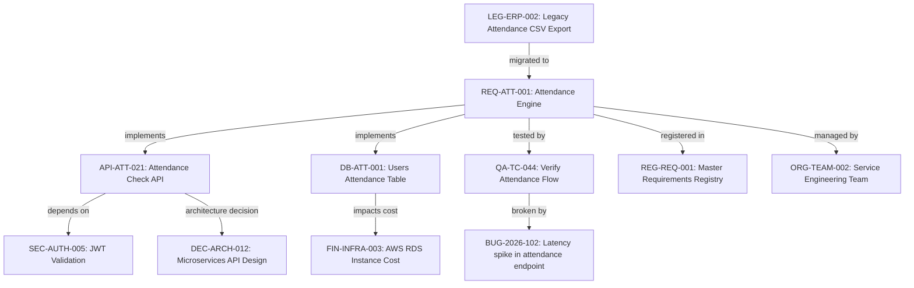

# Traceability & Entity Graph Matrix - MDS v7.0

Góc nhìn trực quan hóa từ đồ thị thực thể (Entity Graph) của MDS v7.0.

## Đồ Thị Liên Kết Vết Chi Tiết (Mô-đun Điểm Danh - Attendance)

```mermaid
graph TD
    REQ[REQ-ATT-001: Attendance Engine] -->|implements| API[API-ATT-021: Attendance Check API]
    REQ -->|implements| DB[DB-ATT-001: Users Attendance Table]
    REQ -->|tested by| TC[QA-TC-044: Verify Attendance Flow]
    API -->|depends on| SEC[SEC-AUTH-005: JWT Validation]
    DB -->|impacts cost| FIN[FIN-INFRA-003: AWS RDS Instance Cost]
    TC -->|broken by| BUG[BUG-2026-102: Latency spike in attendance endpoint]
    LEG[LEG-ERP-002: Legacy Attendance CSV Export] -->|migrated to| REQ
    REQ -->|registered in| REG[REG-REQ-001: Master Requirements Registry]
    REQ -->|managed by| TEAM[ORG-TEAM-002: Service Engineering Team]
    API -->|architecture decision| DEC[DEC-ARCH-012: Microservices API Design]
```
