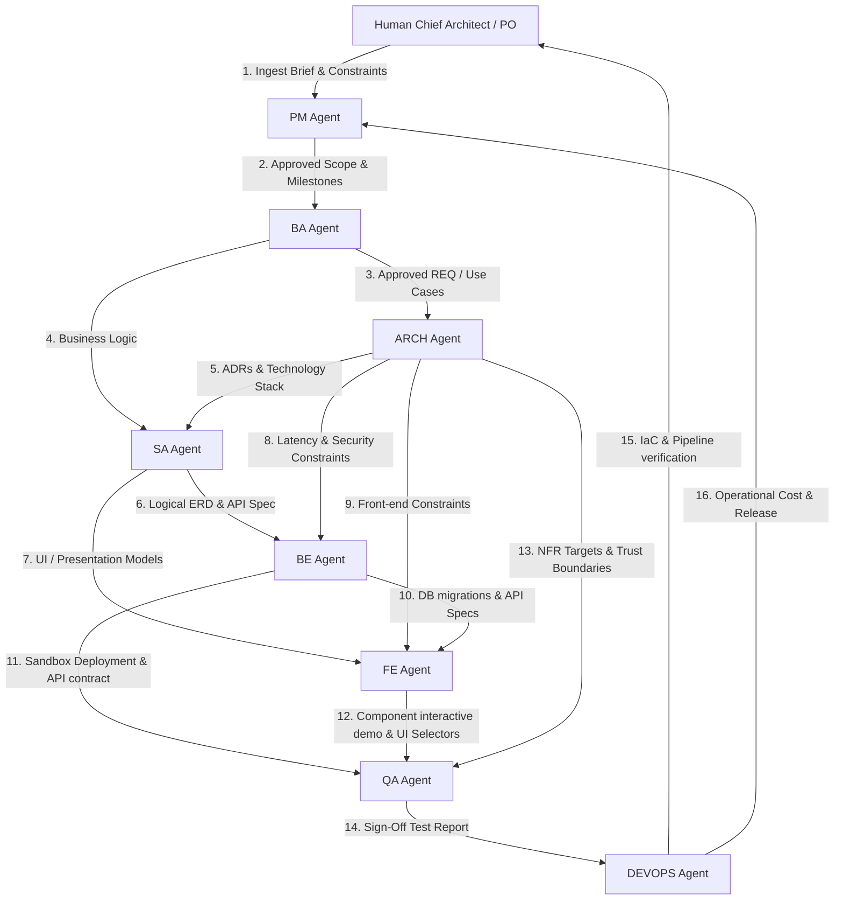

# Bản đồ Kiến trúc Nhân sự AI — Agent Dependency Topology (agent_topology)

> **Vai trò:** AI Workforce Topology & Dependency Spec (Bản đồ Quan hệ và Phụ thuộc Nhân sự AI)
> **Sứ mệnh:** Định nghĩa sơ đồ luồng dữ liệu nghiệp vụ, quan hệ phụ thuộc chéo (DAG) và cơ chế kích hoạt (Handoff/Trigger Rules) giữa 8 AI Agent trong hệ thống MDS.

---

## 1. Biểu đồ luồng phụ thuộc chiến dịch (Agent Activation DAG)

Hệ thống hoạt động dưới mô hình Đồ thị có hướng không chu trình (DAG) để điều phối tiến trình từ lúc tiếp nhận ý tưởng của con người đến khi triển khai hệ thống lên Production:

---

## 2. Ma trận Quan hệ Phụ thuộc (Dependency Matrix)

| Tác nhân (Agent) | Phụ thuộc đầu vào từ (Ingests From) | Sản phẩm bàn giao cho (Delivers To) |
| :--- | :--- | :--- |
| **`pm_agent`** | Con người (Human PO) | `ba_agent`, `arch_agent` |
| **`ba_agent`** | `pm_agent` (`approved_pm_scope.md`) | `arch_agent`, `sa_agent` |
| **`arch_agent`** | `ba_agent` (`ba-req-*`), `pm_agent` (`constraints.md`) | `sa_agent`, `be_agent`, `fe_agent`, `qa_agent` |
| **`sa_agent`** | `ba_agent` (`ba-req-*`), `arch_agent` (`arch-adr-*`) | `be_agent`, `fe_agent` |
| **`be_agent`** | `sa_agent` (Logical ERD/API), `arch_agent` (HLD/ADR) | `fe_agent`, `qa_agent` |
| **`fe_agent`** | `sa_agent` (View Models), `be_agent` (API spec), `arch_agent` | `qa_agent` |
| **`qa_agent`** | `ba_agent` (AC), `arch_agent` (NFR), `be_agent` / `fe_agent` | `devops_agent`, `pm_agent` |
| **`devops_agent`**| `qa_agent` (`qa-report`), `be_agent`/`fe_agent` (Source code/IaC) | `pm_agent`, Con người (Human) |

---

## 3. Quy tắc Handoff & Trạng thái chuyển đổi (Trigger Rules)

Quy trình tự động chuyển tiếp công việc giữa các Agent được áp đặt dựa trên các trạng thái tài liệu (`status`):

### 3.1 Kích hoạt Phân tích Nghiệp vụ (PM ➔ BA Trigger)
*   **Điều kiện kích hoạt**: 
    *   `project_brief.md` và `constraints.md` đạt trạng thái `APPROVED` bởi con người.
    *   `approved_pm_scope.md` được PM xuất bản.
*   **Trạng thái BA**: Chuyển các tài liệu đặc tả yêu cầu liên quan từ `PENDING` sang `DRAFT` để bắt đầu phân tích.

### 3.2 Kích hoạt Thiết kế Kiến trúc (BA ➔ ARCH Trigger)
*   **Điều kiện kích hoạt**:
    *   Các tài liệu `ba-req` cốt lõi đạt trạng thái `APPROVED` bởi con người.
*   **Trạng thái ARCH**: Chuyển các tài liệu bản ghi quyết định kiến trúc (`arch-adr`) từ `PENDING` sang `DRAFT`.

### 3.3 Kích hoạt Triển khai Lập trình (SA/ARCH ➔ BE/FE Trigger)
*   **Điều kiện kích hoạt**:
    *   `arch-adr` tương ứng được `APPROVED`.
    *   `sa-spec` (nếu dự án phức tạp) chứa API Spec và ERD logic được `APPROVED`.
*   **Trạng thái BE/FE**: Chuyển tệp tin kỹ thuật `be-spec` và `fe-spec` sang `DRAFT` và bắt đầu viết code thực tế.

### 3.4 Kích hoạt Kiểm thử (BE/FE ➔ QA Trigger)
*   **Điều kiện kích hoạt**:
    *   `be-spec` và `fe-spec` được `APPROVED`.
    *   Mã nguồn đã qua Unit/Integration Test cục bộ thành công.
    *   FE cung cấp đủ `data-testid` selectors; BE cung cấp xong database migrations.
*   **Trạng thái QA**: Kích hoạt chạy test suite tự động, thực thi test k6/pentest để ra báo cáo `qa-report`.

### 3.5 Kích hoạt Phát hành (QA ➔ DevOps Trigger)
*   **Điều kiện kích hoạt**:
    *   Báo cáo `qa-report` đạt trạng thái `APPROVED` (không còn lỗi Blocker/Critical, pass rate >= 95%).
*   **Trạng thái DevOps**: Kích hoạt pipeline CI/CD release lên production, xuất bản báo cáo chi phí vận hành `devops-spec`.

---

## 4. Cơ chế chống đứt gãy luồng (Deadlock & Cycle Prevention)

Để ngăn chặn tình trạng vòng lặp phụ thuộc tuần hoàn (ví dụ: BE chờ FE API Spec, FE chờ BE triển khai), hệ thống quy định:
1.  **Hợp đồng API trước (Contract First)**: SA hoặc BE/FE phải cùng thống nhất và duyệt API Spec mức `DRAFT/REVIEW` trước khi viết bất kỳ dòng logic code nào.
2.  **Mocking Policy**: FE bắt buộc phải sử dụng Mock Data được định nghĩa trong contract để phát triển độc lập, không đợi BE hoàn thành database vật lý.
