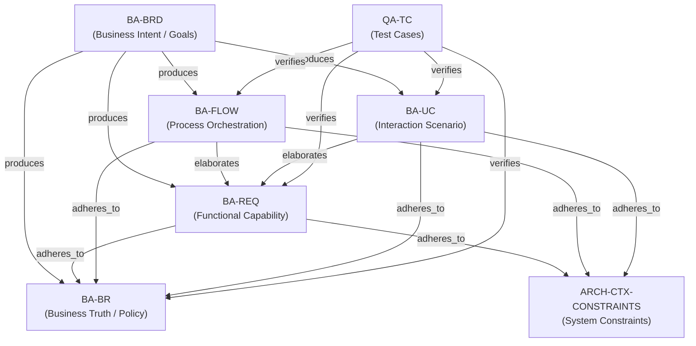

# MDS BA Layer Traceability & Graph Standards

> **MDS Version Compatibility:** >= 1.0  
> **Status:** FROZEN  
> **Version:** BA_TRACEABILITY_V1.0  
> **Scope:** Quy chuẩn liên kết đồ thị tri thức tầng BA (Business Analysis Layer)

Tài liệu này đóng băng (freeze) cấu trúc đồ thị hướng không vòng lặp (DAG) và bộ từ điển thuật ngữ liên kết (Relation Glossary) của phân lớp Nghiệp vụ (BA Layer), đảm bảo tính nhất quán tuyệt đối cho cả con người viết tài liệu và các AI Agents tự động duyệt đồ thị (Graph Traversal).

---

## 1. Đồ thị Phân cấp BA Layer (BA Layer Hierarchy DAG)

Mọi thực thể tài liệu thuộc BA Layer khi được tạo ra phải tuân thủ nghiêm ngặt mô hình phân rã và liên kết dưới đây:

---

## 2. Từ Điển Thuật Ngữ Liên Kết (Relation Glossary)

Mọi liên kết được khai báo trong YAML Frontmatter của các tài liệu tầng BA bắt buộc phải sử dụng chính xác các loại quan hệ (Edge Types) sau:

### 2.1 `produces` (Sinh ra)
*   **Hướng khai báo:** Outbound từ tài liệu cha.
*   **Ngữ nghĩa (Semantics):** Tài liệu mức vĩ mô sinh ra các tài liệu chi tiết hơn để làm cơ sở triển khai.
*   **Phạm vi áp dụng:** Chỉ được phép sử dụng từ `BRD` trỏ xuống các thực thể con (`REQ`, `BR`, `FLOW`, `UC`).
*   **Ví dụ:** `BA-BRD-EDU-001` ➔ `produces` ➔ `BA-REQ-EDU-AUTH-001`.

### 2.2 `elaborates` (Làm rõ / Chi tiết hóa)
*   **Hướng khai báo:** Outbound từ tài liệu làm rõ.
*   **Ngữ nghĩa (Semantics):** Mô tả chi tiết hành vi thực thi, các bước tương tác hoặc giao diện của một yêu cầu hệ thống mức cao mà không tạo ra quan hệ cha-con trùng lặp.
*   **Phạm vi áp dụng:** Sử dụng từ `FLOW` (Luồng quy trình), `UC` (Use Case), hoặc `UI` (Wireframe) trỏ tới `REQ`.
*   **Ví dụ:** `BA-FLOW-EDU-BILL-001` ➔ `elaborates` ➔ `BA-REQ-EDU-BILL-001`.

### 2.3 `adheres_to` (Tuân thủ / Bị ràng buộc bởi)
*   **Hướng khai báo:** Outbound từ tài liệu bị ràng buộc.
*   **Ngữ nghĩa (Semantics):** Thể hiện yêu cầu chức năng, quy trình hoặc kịch bản tương tác phải tuân thủ nghiêm ngặt theo một luật nghiệp vụ (Business Rule) hoặc ràng buộc hệ thống tối cao (System Constraints).
*   **Phạm vi áp dụng:** Từ `REQ`, `FLOW`, `UC` trỏ tới `BR` hoặc `ARCH-CTX-[PROJECT]-CONSTRAINTS`.
*   **Ví dụ:** `BA-REQ-EDU-BILL-001` ➔ `adheres_to` ➔ `BA-BR-EDU-BILL-005` (Luật chiết khấu).

### 2.4 `tested_by` / `verifies` (Kiểm chứng)
*   **Hướng khai báo:** 
    *   `tested_by`: Outbound từ tài liệu nghiệp vụ trỏ tới kịch bản test (`REQ/BR/FLOW/UC` ➔ `TC`).
    *   `verifies`: Outbound từ kịch bản test trỏ ngược về tài liệu nghiệp vụ (`TC` ➔ `REQ/BR/FLOW/UC`).
*   **Ngữ nghĩa (Semantics):** Ánh xạ trực tiếp giữa kịch bản kiểm thử (QA/Automation Test Cases) và yêu cầu nghiệp vụ để tính toán độ phủ (Test Coverage).
*   **Ví dụ:** `QA-TC-EDU-AUTH-044` ➔ `verifies` ➔ `BA-REQ-EDU-AUTH-001`.

### 2.5 `includes` (Nhúng hành vi)
*   **Hướng khai báo:** Outbound từ Use Case chính.
*   **Ngữ nghĩa (Semantics):** Biểu diễn mối quan hệ bắt buộc nhúng hành vi của Use Case con vào trong Use Case chính (Tương đương quan hệ UML Include).
*   **Phạm vi áp dụng:** Chỉ dùng giữa Use Case với Use Case (`UC` ➔ `UC`).
*   **Ví dụ:** `BA-UC-EDU-BILL-001` (Thanh toán) ➔ `includes` ➔ `BA-UC-EDU-AUTH-001` (Đăng nhập).

### 2.6 `extends` (Mở rộng hành vi)
*   **Hướng khai báo:** Outbound từ Use Case mở rộng.
*   **Ngữ nghĩa (Semantics):** Biểu diễn mối quan hệ mở rộng hành vi của Use Case cơ sở dưới một điều kiện cụ thể (Tương đương quan hệ UML Extend).
*   **Phạm vi áp dụng:** Chỉ dùng giữa Use Case với Use Case (`UC` ➔ `UC`).
*   **Ví dụ:** `BA-UC-EDU-BILL-002` (Áp mã giảm giá) ➔ `extends` ➔ `BA-UC-EDU-BILL-001` (Thanh toán).

### 2.7 `depends_on` (Phụ thuộc cùng cấp)
*   **Hướng khai báo:** Outbound từ tài liệu phụ thuộc.
*   **Ngữ nghĩa (Semantics):** Thể hiện sự phụ thuộc logic cùng cấp (ví dụ: Yêu cầu chức năng A hoạt động thì yêu cầu B phải được đáp ứng trước).
*   **Phạm vi áp dụng:** Sử dụng ngang cấp giữa các thực thể cùng loại (`REQ` ➔ `REQ`, `FLOW` ➔ `FLOW`, `UC` ➔ `UC`). Ghi chú: Cấm lạm dụng cho các liên kết chéo cấp.
*   **Ví dụ:** `BA-REQ-EDU-BILL-002` ➔ `depends_on` ➔ `BA-REQ-EDU-BILL-001`.

---

## 3. Quy Tắc Ràng Buộc Đồ Thị Tri Thức (Graph Integrity Rules)

1.  **Quy tắc Hướng Không Vòng Lặp (DAG Constraint)**:
    Cấm hoàn toàn việc tạo liên kết chéo tuần hoàn (ví dụ: A depends_on B, B depends_on A). Mọi liên kết chéo tuần hoàn sẽ bị Graph Engine block khi chuyển trạng thái sang `APPROVED`.
2.  **Quy tắc Thực thể Mồ côi (Orphan Entity Rule)**:
    Mọi tài liệu tầng BA (trừ `BRD` là gốc của layer) bắt buộc phải có ít nhất một liên kết Upstream (`implements` hoặc `elaborates` hoặc `adheres_to`) trỏ tới thực thể cha hoặc thực thể liên quan.
3.  **Ràng buộc Tính hiệu lực (Validity Constraint)**:
    Cấm thiết lập liên kết trỏ tới các thực thể có `lifecycle_state` là `DEPRECATED`. Các thực thể có trạng thái `ARCHIVED` được phép liên kết cho mục đích truy vết lịch sử nhưng không được làm cơ sở cho luồng code/test active hiện tại.
