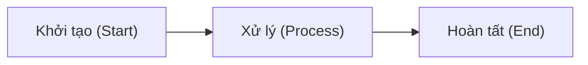
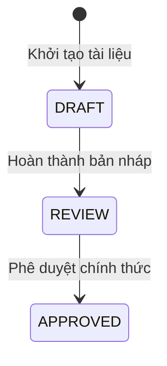
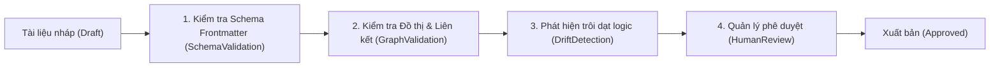

> **Status**: CANONICAL_TEMPLATE
> **Version**: BASE_GUIDE_V1.1
> **Compatibility**: MDS >= 1.0

# MDS Base Template & Markdown Guide

Tài liệu này đóng vai trò là **Hiến pháp Đặc tả (Constitutional Document)** thiết lập tiêu chuẩn trình bày văn bản Markdown, siêu dữ liệu Frontmatter, cấu hình thực thể tri thức, nhúng YAML tự động và kiểm thử chất lượng cho toàn bộ tài liệu con của **MDS (Master Documentation System)**.

---

## 0. Quy Tắc Chung (General Rules)

### 0.0 Thứ Bậc Thẩm Quyền Pháp Lý (Canonical Authority Hierarchy)
Khi xảy ra xung đột hoặc mâu thuẫn về quy chuẩn thiết kế, quy tắc nghiệp vụ hoặc quan hệ đồ thị giữa các tài liệu, hệ thống tự động áp dụng quy tắc **Cấp trên ghi đè Cấp dưới (Higher authority overrides lower authority)** theo thứ bậc sau:

1.  [`DOCUMENT_STANDARDS.md`](file:///d:/HoangDang/IT/MDS%20(Master%20Documentation%20System)/CORE/standards/DOCUMENT_STANDARDS.md) (Thẩm quyền tối cao về format & syntax).
2.  [`entity_schema.md`](file:///d:/HoangDang/IT/MDS%20(Master%20Documentation%20System)/core/schemas/entity_schema.md) (Thẩm quyền về định nghĩa thực thể).
3.  [`relationship_rules.md`](file:///d:/HoangDang/IT/MDS%20(Master%20Documentation%20System)/core/standards/relationship_rules.md) (Thẩm quyền về các cạnh đồ thị được phép).
4.  [`base_template_guide.md` (Tài liệu hiện tại)](file:///d:/HoangDang/IT/MDS%20(Master%20Documentation%20System)/core/standards/base_template_guide.md) (Thẩm quyền về Markdown & YAML blocks).
5.  Các tài liệu biểu mẫu con (Child Templates).
6.  Các tài liệu dự án cụ thể (Project Documents).

### 0.1 Quy Tắc Kế Thừa Biểu Mẫu (Template Inheritance Rules)
Mọi tài liệu con (Child Templates) và tài liệu dự án kế thừa bắt buộc phải giữ nguyên cấu trúc khung Frontmatter, phân cấp tiêu đề chính, các quy tắc đồ thị tri thức và checklist chất lượng từ tài liệu Master này. Tài liệu con được phép mở rộng các mục con chi tiết nhưng tuyệt đối cấm phủ định hoặc phá vỡ các quy tắc cha.

Để phục vụ kiểm tra trôi dạt tự động (Drift Detection Pipeline), mọi tài liệu con phải khai báo thuộc tính kế thừa tường minh ở Frontmatter:
```yaml
inherits_from: CORE-BASE-TEMPLATE-GUIDE-V1.1
```

### 0.2 Phân Cấp Tiêu Đề (Header Hierarchy)
Sử dụng phân cấp tiêu đề tuần tự, tuyệt đối không nhảy cóc cấp độ heading:

```markdown
# Tiêu đề tài liệu H1 (Duy nhất 1 heading H1 ở đầu trang)
## Các phần chính H2
### Các mục con H3
#### Các chi tiết bổ trợ H4
```

### 0.3 Hộp Cảnh Báo Trực Quan (GitHub Alerts)
Sử dụng hộp cảnh báo có cấu trúc để phân loại các mức độ lưu ý:

> [!NOTE]
> Thông tin bổ sung, giải thích ngữ cảnh hoặc làm rõ thiết kế.

> [!TIP]
> Khuyến nghị tối ưu hóa hiệu năng, best practices hoặc mẹo xử lý nhanh.

> [!IMPORTANT]
> Yêu cầu bắt buộc hoặc các bước quan trọng không được bỏ qua.

> [!WARNING]
> Cảnh báo thay đổi lớn, nguy cơ không tương thích hoặc trôi dạt tài liệu.

> [!CAUTION]
> Rủi ro nghiêm trọng liên quan đến an ninh dữ liệu, chi phí vận hành hoặc sập hệ thống.

### 0.4 Phân Tách Lớp Tài Liệu (Layer Separation & No Tech Leakage)
*   **Phân lớp Nghiệp vụ (BA Layer)**: Phải hoàn toàn độc lập công nghệ (Technology-Agnostic). Cấm rò rỉ các cài đặt công nghệ vào ngôn ngữ mô tả.
*   **Phân lớp Kiến trúc (Architecture Layer)**: Được phép đề xuất các công nghệ, framework, nền tảng hoặc nhà cung cấp đám mây cụ thể để đối sánh giải pháp.
*   **Phân lớp Triển khai (Implementation Layer)**: Được phép chứa code snippets, DB schema migrations, cấu hình endpoints chi tiết.

*Bảng đối sánh ví dụ:*
| Lớp tài liệu (Layer) | Thuật ngữ được phép (Allowed) | Thuật ngữ cấm rò rỉ (Leakage) |
| :--- | :--- | :--- |
| **BA Layer** | Payment Gateway (Cổng thanh toán) | Stripe SDK / Webhook endpoint |
| **Architecture Layer** | Stripe Gateway / AWS RDS PostgreSQL | Bảng DB `user_payment_details` |
| **Implementation Layer** | SQL migration scripts / Prisma schema | [Không giới hạn] |

### 0.5 Nguyên Tắc Không Mơ Hồ (Zero Ambiguity Principle)
Mọi tài liệu đặc tả phải tránh sử dụng các tính từ mơ hồ, không định lượng. Mọi yêu cầu chất lượng phải đi kèm số liệu hoặc tiêu chuẩn đo lường cụ thể:

*   **Từ ngữ cấm dùng (Mơ hồ):** `fast` (nhanh), `scalable` (dễ mở rộng), `robust` (mượt mà), `secure` (bảo mật), `stable` (ổn định).
*   **Định lượng thay thế (Chuẩn xác):** `response_time < 200ms`, `supports 10k concurrent users`, `AES-256 encryption`, `99.95% uptime SLA`.

### 0.6 Tham Chiếu Thuật Ngữ Trung Tâm (Terminology Source of Truth)
Mọi thuật ngữ kỹ thuật, khái niệm hoặc định nghĩa cốt lõi trong MDS (như `lifecycle_state`, `execution_state`, `orphan`, `drift`, `traceability`) bắt buộc phải tham chiếu và sử dụng định nghĩa nhất quán tại Glossary trung tâm (`CORE-GLOSSARY-V1`). Cấm tự ý định nghĩa trùng lặp hoặc mâu thuẫn tại các tài liệu riêng lẻ.

---

## 1. Quy Chuẩn Đồ Thị Tri Thức (MDS Knowledge Graph Rules)

### 1.1 Quy Chuẩn Đặt Mã Định Danh (Canonical ID)
Mọi thực thế dự án bắt buộc phải tuân thủ ID format: `ROLE-TYPE-PROJECT-COMPONENT-NUMBER`
*   Ví dụ: `BA-REQ-EDU-BILL-001`, `ARCH-SEC-EDU-AUTH-001`.
*   Riêng các tài liệu meta-doc hệ thống (như tài liệu này hoặc files standards) sử dụng canonical ID dạng: `CORE-[NAME]-V[NUM]` (ví dụ: `CORE-BASE-TEMPLATE-GUIDE-V1.1`).

### 1.2 Quy Tắc Cạnh Hướng Ra (Outbound Links Only)
Frontmatter của tài liệu chỉ khai báo các liên kết hướng ra (Outbound Links) trỏ tới tài liệu cha hoặc tài liệu liên quan cấp trên. Graph Engine sẽ tự động biên dịch và hiển thị Inbound Links khi hiển thị. Cấm tự chế các quan hệ (edges) nằm ngoài danh mục đã đăng ký chính thức tại `relationship_rules.md`. Mọi tài liệu phải có ít nhất 1 liên kết Outbound/Inbound hợp lệ trỏ tới hệ thống để tránh lỗi mồ côi (Orphan Entity Rule).

### 1.3 Quy Tắc Đồ Thị Hướng Không Vòng (DAG Invariant)
Đồ thị tri thức lõi của MDS bắt buộc phải là đồ thị hướng không vòng (Directed Acyclic Graph). Cấm mọi liên kết tuần hoàn (A ➔ B ➔ C ➔ A).

---

## 2. Quy Chuẩn YAML Machine-Readable

Khối mã YAML machine-readable là bắt buộc để hỗ trợ các AI Agents sinh mã nguồn tự động, sinh QA test cases và tự động kiểm tra sự trôi dạt tài liệu (Drift Detection).

### 2.1 Cú Pháp YAML Hợp Lệ
*   Sử dụng dấu cách (2 spaces), tuyệt đối không dùng phím Tab để thụt dòng.
*   Cấu trúc phân cấp khóa rõ ràng, định dạng các thuộc tính dạng `snake_case`.

### 2.2 Khối Mã Độc Lập (Fenced Block)
Bao bọc YAML bằng ký tự 3 dấu nháy ngược kèm định danh ngôn ngữ:

```yaml
data_schema:
  entity_id: BA-REQ-001
  fields:
    - name: user_id
      type: string
```

---

## 3. Quy Chuẩn Sơ Đồ Mermaid.js

MDS sử dụng Mermaid.js để trực quan hóa luồng xử lý và kiến trúc hệ thống.

*   **Syntax Guardrail**: Bao bọc nhãn có ký tự đặc biệt hoặc khoảng trắng bằng dấu nháy kép để tránh lỗi biên dịch (Syntax Error). Ví dụ: `id["Nhãn của Node (Chi tiết)"]`.

### 3.1 Sơ đồ Flowchart


### 3.2 Sơ đồ Tuần Tự (Sequence Diagram)
```mermaid
sequenceDiagram
    actor Actor
    participant System
    Actor->>System: Gửi yêu cầu (Call API)
    System-->>Actor: Phản hồi dữ liệu (Return DTO)
```

### 3.3 Sơ đồ Trạng Thế (State Diagram)


---

## 4. Đường Ống Xác Thực Chất Lượng (Validation Pipeline)

Mọi tài liệu khi đẩy vào hệ thống sẽ được chạy qua đường ống xác thực tự động của các AI Agents trước khi trình cấp quản lý duyệt:



1.  **SchemaValidation**: Khớp cấu trúc siêu dữ liệu Frontmatter (bao gồm `inherits_from` validation) và tính hợp lệ của YAML blocks.
2.  **GraphValidation**: Xác định Orphan Nodes, liên kết vòng (Cyclic Graph) và tính hợp lệ của các loại quan hệ.
3.  **DriftDetection**: So sánh sự bất nhất giữa thiết kế kiến trúc và mã nguồn thực tế (Code vs Docs drift).
4.  **HumanReview**: Trình cho Product Owner và Architect xem xét phê duyệt thủ công.

---

## 5. Chính Sách Quản Trị Phiên Bản (Version Governance)

Mọi thay đổi trên tài liệu MDS phải tuân thủ quy tắc quản trị phiên bản SemVer (`v[MAJOR].[MINOR].[PATCH]`):
*   **MAJOR Bump (X.0.0)**: Thay đổi lớn làm phá vỡ tính tương thích cấu trúc (ví dụ: thay đổi cấu trúc Frontmatter, đổi ID convention).
*   **MINOR Bump (1.X.0)**: Thêm các thuộc tính tùy chọn, bổ sung sơ đồ hoặc mở rộng yêu cầu nghiệp vụ tương thích ngược.
*   **PATCH Bump (1.0.X)**: Sửa lỗi chính tả, định dạng hoặc làm rõ câu chữ không ảnh hưởng đến logic.

---

## 6. Các Anti-Patterns Bị Nghiêm Cấm (Forbidden Anti-Patterns)

*   **Tự chế quan hệ (Custom Edges)**: Tự tạo loại liên kết trong Frontmatter nằm ngoài danh mục chuẩn tắc.
*   **Liên kết vòng (Cyclic Loop)**: Tạo chu kỳ phụ thuộc làm treo các công cụ quét tự động.
*   **Mơ hồ hóa chỉ số**: Ghi nhận các yêu cầu phi chức năng dạng định tính không đo lường được.
*   **Trôi dạt công nghệ (Tech Leakage)**: Đưa thư viện mã nguồn cụ thể hoặc tên DB table vào các tài liệu nghiệp vụ BA.
*   **Thực thể mồ côi (Orphan Node)**: Tạo tài liệu không liên kết với bất kỳ Node nào trong hệ thống.

---

## 7. Bảng Tự Kiểm Tra Chất Lượng Chung (Universal Quality Checklist)

- [ ] ID thực thể khai báo đúng quy chuẩn (`ROLE-TYPE-PROJECT-COMPONENT-NUMBER` hoặc `CORE-NAME-VNUM`).
- [ ] Điền đầy đủ thông tin chuỗi phê duyệt (reviewed_by, approved_by, approved_at) ở Frontmatter.
- [ ] Trạng thái Lifecycle State và Execution State thiết lập phù hợp.
- [ ] Khai báo thuộc tính kế thừa `inherits_from` trỏ tới Master Guide ở Frontmatter.
- [ ] Không có liên kết nào bị mồ côi (Orphan) hoặc liên kết tới Node không tồn tại (Broken Reference).
- [ ] Đồ thị không chứa chu kỳ phụ thuộc vòng (DAG Invariant).
- [ ] Phân cấp headings markdown tuần tự, không nhảy cóc cấp độ.
- [ ] YAML blocks máy đọc được biên dịch hợp lệ không chứa tab.
- [ ] Sơ đồ Mermaid.js render thành công không bị syntax error.
- [ ] Không chứa các tính từ mơ hồ và tuân thủ nguyên tắc Zero Ambiguity.
