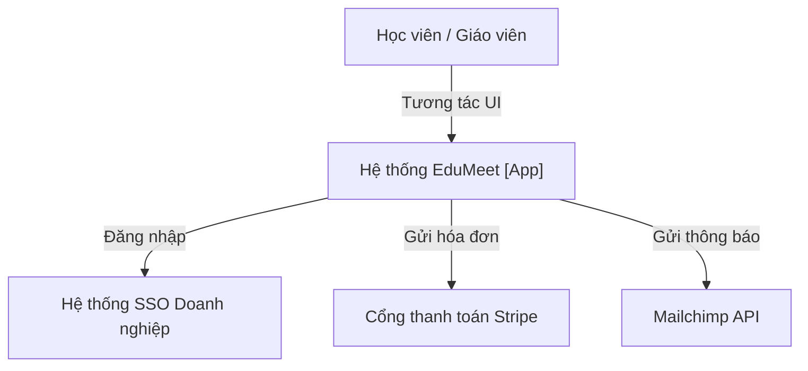
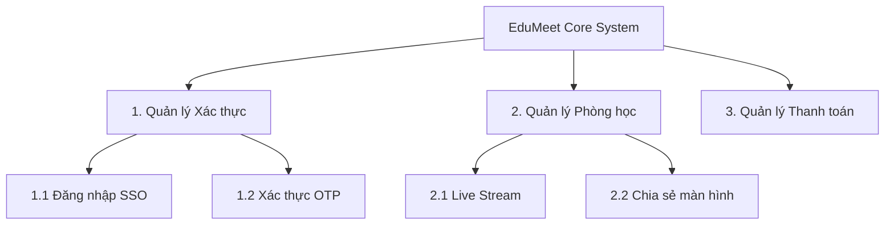

> **Status**: CANONICAL_TEMPLATE
> **Version**: BRD_TEMPLATE_V1.2
> **Compatibility**: MDS >= 1.0

# Business Requirements Document (BRD): [Tên Dự Án]

## 0. Tóm Tắt Nghiệp Vụ (Business Executive Summary)

*   **Bối cảnh dự án**: [Mô tả ngắn gọn về thị trường, vấn đề cốt lõi của doanh nghiệp hoặc khách hàng hiện tại].
*   **Mục tiêu kinh doanh (Business Objectives)**: [Ví dụ: Đạt 10,000 người dùng hoạt động hàng tháng (MAU) trong 6 tháng đầu tiên].
*   **KPIs Đo lường thành công**: [Ví dụ: Thời gian tạo phòng học trực tuyến giảm xuống dưới 10 giây].
*   **Chủ sở hữu**: ba_agent

### 0.1 Business Case & Financial Justification

| Chỉ số tài chính (Metric) | Giá trị dự kiến (Value) | Mô tả chi tiết |
| :--- | :---: | :--- |
| **Estimated Cost** | $50,000 | Tổng ngân sách dự chi phát triển & vận hành năm đầu. |
| **Expected Revenue** | $125,000 | Doanh thu dự kiến thu về từ phí bản quyền/thuê bao năm đầu. |
| **ROI (Return on Investment)** | 150% | Tỷ suất hoàn vốn đầu tư sau 1 năm. |
| **Payback Period** | 12 tháng | Thời gian thu hồi hoàn toàn vốn đầu tư ban đầu. |
| **Revenue Model** | subscription | Mô hình doanh thu (ví dụ: subscription, licensing, transaction fee). |

---

## 1. Tổng quan yêu cầu & Ràng buộc (Business Scope & Constraints)

### 1.1 Phạm vi nghiệp vụ (In-Scope vs Out-of-Scope)
*   **Thuộc phạm vi (In-Scope)**:
    - [Ví dụ: Hệ thống xác thực đăng nhập một lần SSO].
    - [Ví dụ: Tính năng live streaming lớp học realtime dưới 100 học viên].
*   **Nằm ngoài phạm vi (Out-of-Scope)**:
    - [Ví dụ: Tích hợp thanh toán bằng tiền mã hóa].
    - [Ví dụ: Hệ thống tự động chấm điểm bài tập tự luận bằng AI].

### 1.2 Sơ đồ ngữ cảnh nghiệp vụ (Mermaid Context Diagram)



### 1.3 Giả định, Ràng buộc & Phụ thuộc (Constraints & Assumptions)

```yaml
project_constraints:
  assumptions:
    - users_have_stable_internet_above_20mbps
  constraints:
    - data_hosting_on_premise_compliance
  dependencies:
    - school_enterprise_sso_gateway_integration
```

---

## 2. Stakeholders & Đối tượng sử dụng (Stakeholders & Personas)

### 2.1 Ma trận Stakeholder (Stakeholder Matrix)

| Stakeholder Role | Ảnh hưởng (Influence) | Mức độ quan tâm (Interest Level) | Lĩnh vực quan tâm (Domain Interest) | Vai trò trong dự án |
| :--- | :---: | :---: | :--- | :--- |
| `SCHOOL_DIRECTOR` | **HIGH** | **HIGH** | BUSINESS_GOVERNANCE | Nhà tài trợ dự án, phê duyệt ngân sách và nghiệm thu. |
| `FINANCE_TEAM` | **MEDIUM** | **HIGH** | BILLING | Kiểm duyệt luồng thanh toán hóa đơn, đối soát công nợ. |
| `LEGAL_TEAM` | **HIGH** | **HIGH** | COMPLIANCE | Giám sát tuân thủ bảo mật dữ liệu học viên (GDPR/HIPAA). |

```yaml
stakeholders:
  - role: school_director
    influence: HIGH
    interest_level: HIGH
    domain_interest: BUSINESS_GOVERNANCE
  - role: finance_team
    influence: MEDIUM
    interest_level: HIGH
    domain_interest: BILLING
  - role: legal_team
    influence: HIGH
    interest_level: HIGH
    domain_interest: COMPLIANCE
```

### 2.2 Ma trận người dùng (User Personas)

| Tên vai trò (Actor) | Mục tiêu chính (Goals) | Nỗi đau hiện tại (Pains) | Mong muốn (Gains) |
| :--- | :--- | :--- | :--- |
| `TEACHER` (Giáo viên) | Tạo và điều hành lớp học online dễ dàng, tương tác mượt mà. | Học viên thường xuyên bị rớt mạng, khó chia sẻ bài giảng PDF/Video. | Giao diện dạy học trực quan, chia sẻ file nhanh, quản lý mic học viên tốt. |
| `STUDENT` (Học viên) | Tham gia lớp học chỉ với 1 click, xem lại video record bài giảng. | Quy trình đăng ký lớp học rườm rà, chất lượng video stream kém. | Kết nối realtime ổn định, xem lại bài giảng cũ dễ dàng. |

```yaml
personas:
  - actor: TEACHER
    goals:
      - create_classroom
      - share_media_files
    pains:
      - bad_realtime_connectivity
  - actor: STUDENT
    goals:
      - join_classroom_with_link
      - review_recorded_session
    pains:
      - complex_registration_flow
```

---

## 3. Đặc tả Yêu cầu Nghiệp vụ mức cao (High-Level Requirements)

### 3.1 Sơ đồ phân rã chức năng (Functional Decomposition Tree)



### 3.2 Ma trận yêu cầu chức năng & Tiêu chí nghiệm thu (HLR Matrix)

*Quy tắc độ ưu tiên (MoSCoW)*:
*   **MUST HAVE** (Bắt buộc phải có trong phiên bản này)
*   **SHOULD HAVE** (Nên có nếu có thể)
*   **COULD HAVE** (Có thể có nếu không ảnh hưởng tiến độ)
*   **WON'T HAVE** (Chưa làm trong phiên bản này, dời sang tương lai)

| ID yêu cầu | Tên yêu cầu mức cao | Mô tả nghiệp vụ | Ưu tiên (MoSCoW) | Tiêu chí nghiệm thu nghiệp vụ (Acceptance Criteria) |
| :--- | :--- | :--- | :---: | :--- |
| `HLR-001` | Đăng nhập SSO đa nền tảng | Đăng nhập qua tài khoản Google/Microsoft. | **SHOULD HAVE** | 100% tài khoản nội bộ trường học đăng nhập thành công qua SSO của trường. |
| `HLR-002` | Live stream realtime | Truyền tải âm thanh/hình ảnh ổn định độ trễ thấp. | **MUST HAVE** | Thời gian giáo viên tạo phòng học trực tuyến và gửi link mời < 5 giây. |
| `HLR-003` | Thanh toán học phí tự động | Cho phép đóng tiền học qua thẻ và xuất hóa đơn. | **COULD HAVE** | Giao dịch được Stripe xác nhận, tự động gửi hóa đơn PDF qua email trong 30 giây. |

### 3.3 Machine-Readable Requirements Mapping (YAML)
```yaml
high_level_requirements:
  - id: HLR-001
    name: sso_multi_platform
    moscow_priority: SHOULD
    acceptance_criteria: sso_login_success_rate_100
    target_req: [BA-REQ-[PROJECT]-AUTH-001]
  - id: HLR-002
    name: realtime_live_stream
    moscow_priority: MUST
    acceptance_criteria: room_creation_time_under_5s
    target_req: [BA-REQ-[PROJECT]-MEDIA-001]
  - id: HLR-003
    name: automatic_billing
    moscow_priority: COULD
    acceptance_criteria: stripe_payment_invoice_under_30s
    target_req: [BA-REQ-[PROJECT]-BILL-001]
```

### 3.4 Kỳ vọng phi chức năng mức cao (High-Level NFR Expectations)

Đặc tả các kỳ vọng chất lượng làm Driver sinh ra các `SA-NFR` chi tiết:

| Nhóm NFR | Chỉ tiêu kỳ vọng (Target Expectations) | Ý nghĩa nghiệp vụ |
| :--- | :--- | :--- |
| **Availability** | Uptime > 99.9% | Đảm bảo hệ thống lớp học trực tuyến không bị gián đoạn trong giờ học. |
| **Latency** | Độ trễ âm thanh/hình ảnh < 200ms | Đảm bảo trải nghiệm dạy học tương tác realtime tự nhiên. |
| **Security** | Đạt chuẩn OWASP ASVS Level 2 | Bảo vệ thông tin cá nhân và điểm số của học viên khỏi rò rỉ. |

---

## 4. Danh sách Rủi ro Nghiệp vụ (Business Risks)

| Mã rủi ro | Mô tả rủi ro nghiệp vụ (Risk) | Độ nghiêm trọng | Giải pháp giảm thiểu đề xuất (Mitigation) |
| :--- | :--- | :---: | :--- |
| `BR-RSK-001` | Tỷ lệ giáo viên từ chối sử dụng hệ thống mới do giao diện phức tạp (Adoption Risk). | **HIGH** | Tổ chức 2 buổi training và xây dựng tài liệu Hướng dẫn sử dụng trực quan. |
| `BR-RSK-002` | Rò rỉ thông tin cá nhân học viên vi phạm GDPR dẫn đến phạt hành chính (Compliance Risk). | **CRITICAL** | Áp dụng chính sách Data Classification và bắt buộc mã hóa AES-256 đối với PII. |

```yaml
business_risks:
  - id: BR-RSK-001
    severity: HIGH
    mitigation: teacher_training_sessions
  - id: BR-RSK-002
    severity: CRITICAL
    mitigation: pii_data_encryption_aes256
```

---

## 5. Ma trận truy vết sản phẩm bàn giao (MDS Traceability Matrix)

Ma trận ánh xạ các yêu cầu vĩ mô BRD trỏ tới các tài liệu nghiệp vụ/kỹ thuật cấp dưới được sinh ra:

| Feasibility Study (FSB) | High-Level Requirement (BRD) | Detailed Requirement (REQ) | Business Rule (BR) | Non-Functional Req (NFR) |
| :--- | :--- | :--- | :--- | :--- |
| `PM-FSB-[PROJECT]-001` | `HLR-001` (SSO Login) | `BA-REQ-[PROJECT]-AUTH-001` | `BA-BR-[PROJECT]-AUTH-015` | `SA-NFR-[PROJECT]-AUTH-002` |
| `PM-FSB-[PROJECT]-001` | `HLR-002` (Realtime Stream) | `BA-REQ-[PROJECT]-MEDIA-001` | `BA-BR-[PROJECT]-MEDIA-004` | `SA-NFR-[PROJECT]-SYS-001` |

---

## 6. Bảng Tự Kiểm Tra Chất Lượng BRD (BRD Quality Checklist)

- [ ] Mục tiêu kinh doanh và KPI đã được định lượng rõ ràng bằng các con số cụ thể ở Mục 0.
- [ ] Đặc tả chi tiết các chỉ số Business Case (bao gồm Revenue Model) và hoàn thiện YAML `business_case` ở Mục 0.1.
- [ ] Điền đầy đủ thông tin chuỗi phê duyệt (reviewed_by, approved_by, approved_at) ở Frontmatter.
- [ ] Sơ đồ ngữ cảnh nghiệp vụ Mermaid Context Diagram hiển thị chính xác các tác nhân bên ngoài.
- [ ] Khai báo đầy đủ ma trận Stakeholders (bao gồm phân tách interest_level và domain_interest) và User Personas kèm YAML machine-readable tương ứng.
- [ ] Xây dựng Sơ đồ phân rã chức năng (Functional Decomposition Tree) phân cấp rõ ràng ở Mục 3.1.
- [ ] Định nghĩa rõ ràng Tiêu chí nghiệm thu (Acceptance Criteria) cho từng High-Level Requirement.
- [ ] Quy đổi priority các yêu cầu chức năng sang thang đo chuẩn MoSCoW (Mục 3.2 và 3.3).
- [ ] Đặc tả rõ ràng các kỳ vọng phi chức năng (NFR Expectations) ở Mục 3.4.
- [ ] Đánh giá đầy đủ các Business Risks và biện pháp giảm thiểu ở Mục 4.
- [ ] Xây dựng Ma trận truy vết bàn giao (Traceability Matrix bao gồm cột FSB) ở Mục 5 để kết nối FSB ➔ BRD ➔ REQ ➔ BR ➔ NFR.
- [ ] Đã liên kết đầy đủ các links `adheres_to` trỏ về `constraints.md`, `implements` trỏ về `FSB` khả thi và `depends_on` trỏ về `BRIEF`.
- [ ] Đã khai báo các deliverables `produces` trỏ tới `REQ`, `BR` và `NFR` chi tiết ở Frontmatter.
- [ ] Không có liên kết nào bị Orphan hoặc Broken Reference.
- [ ] **Anti-Pattern Check**: Cấm mô tả giải pháp kỹ thuật chi tiết (như cấu trúc database hay code pattern) trong BRD.
- [ ] **Anti-Pattern Check**: Cấm trộn lẫn các yêu cầu nghiệp vụ thuần túy với các cài đặt kỹ thuật của nhà phát triển.
- [ ] **Anti-Pattern Check**: Không có yêu cầu nào ghi chung chung dạng mơ hồ ("fast", "easy-to-use") mà không đi kèm số liệu hoặc tiêu chuẩn đo lường cụ thể.
- [ ] **Anti-Pattern Check**: Phạm vi Out-of-Scope được định nghĩa rõ ràng để tránh trôi dạt yêu cầu (scope creep).