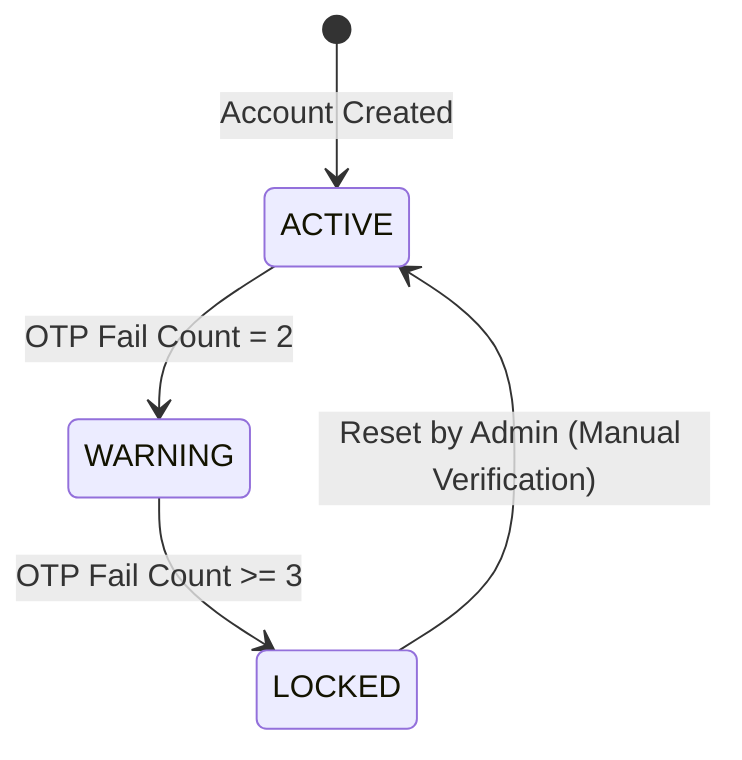

> **Status**: CANONICAL_TEMPLATE
> **Version**: BR_TEMPLATE_V1.1
> **Compatibility**: MDS >= 1.0

# Business Rule Spec: [Tên Quy Tắc Nghiệp Vụ]

## 0. Tóm Tắt Quy Tắc (Rule Summary)

*   **Phân loại quy tắc**: Constraint (Ràng buộc) | Derivation (Tính toán/Suy diễn) | Action Assertion (Kích hoạt)
*   **Trạng thái luật (Rule Status)**: Active (Đang áp dụng) | Suspended (Tạm ngưng) | Overridden (Bị ghi đè) | Retired (Hết hiệu lực)
*   **Validity Window**: [Ví dụ: Áp dụng từ 2026-01-01 đến 2026-12-31].
*   **Chủ sở hữu**: ba_agent

---

## 1. Mô tả luật nghiệp vụ (Rule Narrative & Context)

### 1.1 Bối cảnh nghiệp vụ (Business Context)
[Mô tả chi tiết tại sao quy tắc này tồn tại. Ví dụ: Để đảm bảo quyền lợi giảng dạy và bảo mật phòng học, giáo viên bắt buộc phải là người khởi tạo và kích hoạt phòng học trực tuyến trước khi cho phép học sinh tham gia].

### 1.2 Tác động nếu vi phạm quy tắc (Impact of Non-Compliance)
[Ví dụ: Học sinh vào trước tự ý chia sẻ tài nguyên không phù hợp, rò rỉ phòng học ra ngoài mạng công cộng].

---

## 2. Chi tiết logic & Công thức tính toán (Rule Specification & Formulas)

### 2.1 Đặc tả logic nghiệp vụ (Logic Specification)
Mô tả chi tiết các bước hoặc điều kiện áp dụng quy tắc.

*Ví dụ: Biểu diễn quy tắc tính chiết khấu hóa đơn dịch vụ:*
*   Nếu khách hàng là `VIP` và tổng giá trị hóa đơn `> $1,000` ➔ Chiết khấu `15%`.
*   Nếu khách hàng là `VIP` và tổng giá trị hóa đơn `<= $1,000` ➔ Chiết khấu `10%`.
*   Khách hàng thường ➔ Chiết khấu `0%`.

### 2.2 Công thức tính toán (Math / Logic Formulas)
Biểu diễn công thức toán học dạng LaTeX (nếu có):

$$Discount = \begin{cases} 0.15 \times InvoiceAmount & \text{if } Customer = VIP \land InvoiceAmount > 1000 \\ 0.10 \times InvoiceAmount & \text{if } Customer = VIP \land InvoiceAmount \le 1000 \\ 0 & \text{otherwise} \end{cases}$$

### 2.3 Bảng Quyết Định Nghiệp Vụ (Decision Table)

| Điều kiện 1: Khách hàng là VIP | Điều kiện 2: Hóa đơn > $1,000 | Hành động (Action): Chiết khấu |
| :---: | :---: | :---: |
| TRUE | TRUE | **15%** |
| TRUE | FALSE | **10%** |
| FALSE | TRUE / FALSE | **0%** |

### 2.4 Machine-Readable Rule Logic (YAML)
```yaml
business_rule_logic:
  rule_id: BA-BR-[PROJECT]-[COMPONENT]-[NUMBER]
  type: DERIVATION
  parameters:
    - name: is_vip_customer
      type: boolean
    - name: invoice_amount
      type: decimal
  decisions:
    - match:
        is_vip_customer: true
        invoice_amount: { gt: 1000 }
      action: { discount: 0.15 }
    - match:
        is_vip_customer: true
        invoice_amount: { lte: 1000 }
      action: { discount: 0.10 }
    - default:
      action: { discount: 0.00 }
```

### 2.5 Chính sách giải quyết xung đột (Rule Conflict Resolution)
Đặc tả phương án xử lý khi có nhiều quy tắc cùng thỏa mãn điều kiện áp dụng đồng thời.

*   **Chiến lược giải quyết (Resolution Strategy)**: PRIORITY_WINS (Quy tắc có Rule Priority cao nhất được áp dụng) | MAX_VALUE (Lấy giá trị chiết khấu lớn nhất) | FIRST_MATCH (Áp dụng quy tắc đầu tiên khớp)
*   **Trọng số ưu tiên (Rule Priority)**: 90

```yaml
conflict_resolution:
  strategy: PRIORITY_WINS
  priority_weight: 90
```

### 2.6 Sơ đồ chuyển đổi trạng thái (State Transition Model)

Áp dụng cho các quy tắc dạng kích hoạt hành động (`ACTION_ASSERTION`) liên quan đến vòng đời trạng thái:



---

## 3. Cách thức xử lý vi phạm luật (Exception & Violation Handling)

Khi người dùng hoặc hệ thống gửi yêu cầu vi phạm quy tắc này, hệ thống bắt buộc phải xử lý như sau:

*   **Mã lỗi nghiệp vụ (Business Error Code)**: `ERR-BR-[COMPONENT]-001` (Ví dụ: `ERR-BR-BILL-001`).
*   **Thông báo lỗi cho người dùng (User Message)**: [Ví dụ: "Hóa đơn chiết khấu không hợp lệ đối với loại khách hàng hiện tại"].
*   **Hành vi Fallback hệ thống**: [Ví dụ: Reset chiết khấu về 0%, từ chối submit transaction].

### 3.1 Cấu hình lỗi Machine-Readable (YAML)
```yaml
violation_handling:
  error_code: ERR-BR-[COMPONENT]-001
  severity: HIGH
  fallback_action: reject_request
  fallback_value: null
```

---

## 4. Kế Hoạch Kiểm Chứng Quy Tắc (Verification Plan & Test Vectors)

Cung cấp các mẫu dữ liệu thử nghiệm (Test Vectors) để QA/Developer kiểm thử tính chính xác của luật nghiệp vụ.

### 4.1 Bảng Test Vectors cho Human
| Vector ID | Đầu vào thử nghiệm (Inputs) | Kết quả kỳ vọng (Expected Output) |
| :--- | :--- | :--- |
| `VEC-001` | `is_vip_customer = true`, `invoice_amount = $1,500` | **Chiết khấu 15% ($225)** |
| `VEC-002` | `is_vip_customer = true`, `invoice_amount = $500` | **Chiết khấu 10% ($50)** |
| `VEC-003` | `is_vip_customer = false`, `invoice_amount = $2,000` | **Chiết khấu 0% ($0)** |

### 4.2 Machine-Readable Test Vectors (YAML)
```yaml
test_vectors:
  target_tc: [QA-TC-[PROJECT]-[COMPONENT]-[NUMBER]]
  vectors:
    - id: VEC-001
      inputs:
        is_vip_customer: true
        invoice_amount: 1500
      expected:
        discount: 225
        error_code: null
    - id: VEC-002
      inputs:
        is_vip_customer: true
        invoice_amount: 500
      expected:
        discount: 50
        error_code: null
    - id: VEC-003
      inputs:
        is_vip_customer: false
        invoice_amount: 2000
      expected:
        discount: 0
        error_code: null
```

---

## 5. Bảng Tự Kiểm Tra Chất Lượng BR (Business Rule Quality Checklist)

- [ ] Phân loại chính xác Rule Type (Constraint, Derivation, Action Assertion) ở Frontmatter.
- [ ] Điền đầy đủ thông tin chuỗi phê duyệt (reviewed_by, approved_by, approved_at) ở Frontmatter.
- [ ] Điền đầy đủ Rule Status và Validity Window (effective_from, effective_until).
- [ ] Logic quy tắc nghiệp vụ độc lập hoàn toàn với nền tảng công nghệ (không ghi nhận code implementation hay DB query).
- [ ] Biểu diễn rõ ràng công thức toán học (nếu có) bằng LaTeX hoặc bảng quyết định (Decision Table).
- [ ] Quy định cụ thể chính sách giải quyết xung đột (Conflict Resolution) và trọng số `rule_priority` (Mục 2.5).
- [ ] Cấu hình sơ đồ trạng thái Mermaid (State Transition Model) đối với Action Assertion rules (Mục 2.6).
- [ ] Đặc tả chi tiết mã lỗi nghiệp vụ (Error Code) và YAML `violation_handling` ở Mục 3.1.
- [ ] Cung cấp đầy đủ các Test Vectors (Inputs/Expected Outputs) dạng bảng và YAML ở Mục 4.
- [ ] Đã liên kết đầy đủ các links `implements` trỏ về `BRD` và `tested_by` trỏ về `TC` tương ứng.
- [ ] Đã gỡ bỏ link ngược `depends_on` trỏ tới REQ (đảm bảo Graph Semantics sạch: REQ sẽ `adheres_to` BR).
- [ ] Không có liên kết nào bị Orphan hoặc Broken Reference.
- [ ] **Anti-Pattern Check**: Cấm mô tả cách cài đặt database, coding framework, hay hạ tầng server trong Business Rule.
- [ ] **Anti-Pattern Check**: Luật nghiệp vụ không chứa các từ ngữ mơ hồ, chung chung gây hiểu nhầm cho nhà phát triển.
- [ ] **Anti-Pattern Check**: Quy tắc nghiệp vụ không chồng chéo hoặc xung đột trực tiếp với các BR khác mà không được khai báo chính sách giải quyết.
- [ ] **Anti-Pattern Check**: Xác định rõ effective date của quy tắc nếu phụ thuộc vào chính sách kinh doanh hoặc quy định pháp lý.