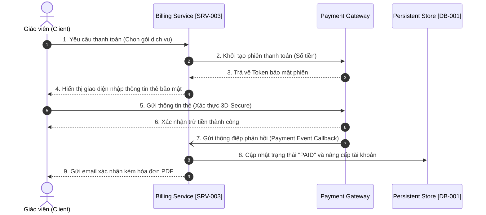
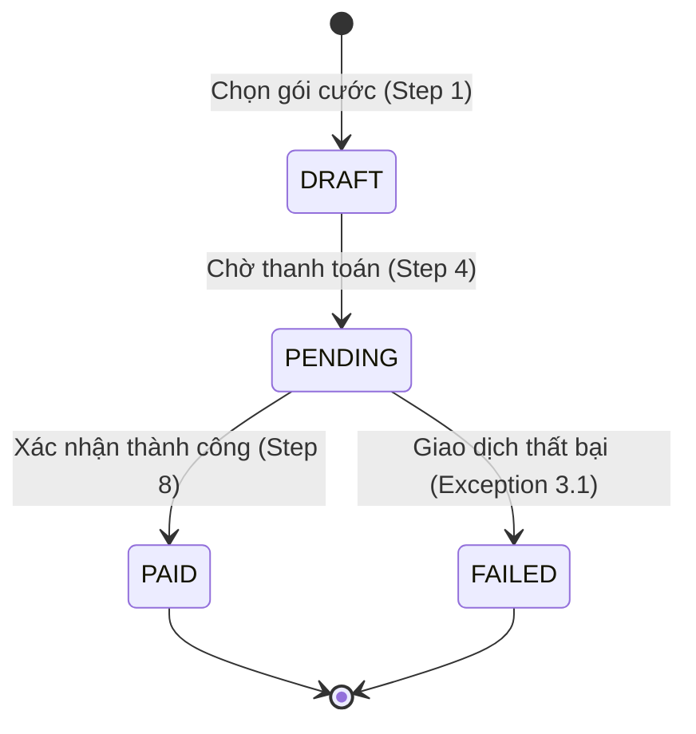

> **Status**: CANONICAL_TEMPLATE
> **Version**: FLOW_TEMPLATE_V1.1
> **Compatibility**: MDS >= 1.0
>
> **BA Layer Traceability**:
> `BRD ── produces ──► {REQ, BR, FLOW}`
> `REQ ── adheres_to ─► BR`
> `FLOW ─ elaborates ─► REQ`
> `TC ─── verifies ──► {REQ, BR, FLOW}`

# Process Flow Spec: [Tên Quy Trình Nghiệp Vụ]

## 0. Tóm Tắt Quy Trình (Process Summary)

*   **Mục tiêu quy trình (Objective)**: [Ví dụ: Giúp giáo viên thanh toán tiền thuê bao lớp học thông qua cổng thanh toán điện tử và kích hoạt tài khoản].
*   **Phân loại quy trình (Process Type)**: CORE (Quy trình cốt lõi) | SUPPORTING (Quy trình hỗ trợ) | EXCEPTION (Quy trình ngoại lệ)
*   **Các tác nhân tham gia (Actors / Swimlanes)**: Teacher (Giáo viên) | Billing Service | Payment Gateway | Admin
*   **Điều kiện kích hoạt (Trigger Condition)**: [Ví dụ: Giáo viên nhấn nút "Nâng cấp tài khoản" trên giao diện Admin Portal].
*   **Kết quả đầu ra (Expected Outcome)**: [Ví dụ: Hóa đơn được thanh toán thành công, tài khoản nâng cấp thành VIP, gửi email thông báo kèm hóa đơn PDF].
*   **Điều kiện đầu vào (Preconditions)**: [Ví dụ: Tài khoản giáo viên đã đăng nhập và chưa bị khóa].
*   **Điều kiện đầu ra (Postconditions)**: [Ví dụ: Tài khoản giáo viên chuyển trạng thái VIP, gói cước mới được ghi nhận].
*   **Chủ sở hữu**: ba_agent

---

## 1. Sơ đồ tương tác và quy trình (Interaction & Process Diagram)

Mô tả trực quan luồng tương tác chéo giữa các tác nhân sử dụng sơ đồ Mermaid.js độc lập công nghệ (No Tech Leakage).



---

## 2. Giải thích chi tiết các bước trong luồng quy trình (Process Flow Narrative)

Đặc tả chi tiết hành động và luật nghiệp vụ ràng buộc cho từng bước thực thi:

| Bước ID | Tác nhân thực hiện | Mô tả hành động chi tiết | Đầu vào (Inputs) | Đầu ra (Outputs) | Luật nghiệp vụ áp dụng (BA-BR ID) |
| :--- | :--- | :--- | :--- | :--- | :--- |
| **Step 1** | User | Chọn gói dịch vụ và nhấn nút "Thanh toán". | Gói cước ID | Hóa đơn nháp | `BA-BR-[PROJ]-BILL-002` (Luật định giá gói cước) |
| **Step 2** | Billing Service | Tạo giao dịch nháp và gửi phiên thanh toán sang cổng. | Hóa đơn nháp | Token bảo mật phiên | `BA-BR-[PROJ]-BILL-005` (Luật chiết khấu tự động) |
| **Step 5** | User | Nhập thông tin thẻ và thực hiện xác thực bảo mật. | Thông tin thẻ | Token thanh toán | [N/A - Xử lý phía Cổng thanh toán] |
| **Step 8** | Billing Service | Nhận thông điệp phản hồi từ cổng, ghi nhận doanh thu. | Callback Payload | Cập nhật DB trạng thái VIP | `BA-BR-[PROJ]-AUTH-012` (Luật phân quyền tài khoản VIP) |

---

## 3. Các luồng ngoại lệ, Thời gian & Trạng thái (Exceptions, SLAs & States)

### 3.1 Luồng ngoại lệ & Fallback (Exception Flows)
Quy định phương án xử lý khi xảy ra lỗi hoặc từ chối thanh toán:

*   **Mã lỗi nghiệp vụ (Business Error Code)**: `ERR-BR-[COMPONENT]-003` (Ví dụ: `ERR-BR-BILL-003`).
*   **Hành vi Fallback**: Giữ nguyên gói cước FREE cũ của giáo viên.

```yaml
exception_flows:
  - id: payment_declined
    error_code: ERR-BR-BILL-003
    severity: HIGH
    fallback_action: keep_free_plan
```

### 3.2 Cam kết thời gian quy trình (Process SLA)
Các giới hạn thời gian ràng buộc đối với từng bước xử lý tự động:

| Bước xử lý (Process Step) | Thời gian cam kết (SLA Target) | Mô tả chi tiết |
| :--- | :---: | :--- |
| **Xác thực phản hồi (Gateway Callback)** | < 10 giây | Từ khi cổng thanh toán trừ tiền đến khi hệ thống cập nhật DB. |
| **Gửi hóa đơn (Invoice Delivery)** | < 30 giây | Thời gian tối đa để hệ thống gửi hóa đơn PDF qua email. |

```yaml
process_sla:
  payment_confirmation: 10s
  invoice_delivery: 30s
```

### 3.3 Sơ đồ chuyển đổi trạng thái của đối tượng (Status Progression Diagram)

Mô tả vòng đời trạng thái của đối tượng chính (ví dụ: Hóa đơn / Giao dịch) đi qua các bước trong quy trình:



---

## 4. Ma Trận Dữ Liệu Trao Đổi (Process Data Exchange YAML)

Khối cấu trúc YAML machine-readable đặc tả các tham số đầu vào và đầu ra chéo dịch vụ phục vụ cho thiết kế API:

```yaml
process_data_exchange:
  process_id: BA-FLOW-[PROJECT]-[COMPONENT]-[NUMBER]
  steps:
    - id: step_1_payment_request
      input:
        package_id: string
        user_id: string
      output:
        draft_invoice_id: string
    - id: step_2_gateway_intent
      input:
        draft_invoice_id: string
      output:
        gateway_security_token: string
    - id: step_8_callback_handling
      input:
        gateway_event_id: string
        payment_status: string
      output:
        account_status: ACTIVE_VIP
        invoice_status: PAID
```

---

## 5. Bảng Tự Kiểm Tra Chất Lượng FLOW (Process Flow Quality Checklist)

- [ ] Quy định cụ thể mục tiêu, phân loại (Process Type), tác nhân tham gia (Swimlanes), trigger và expected outcome ở Mục 0.
- [ ] Đặc tả rõ ràng điều kiện đầu vào (Preconditions) và đầu ra (Postconditions) trong Frontmatter và Mục 0.
- [ ] Điền đầy đủ thông tin chuỗi phê duyệt (reviewed_by, approved_by, approved_at) ở Frontmatter.
- [ ] Có sơ đồ tương tác hoặc quy trình Mermaid.js (flowchart, sequence, state) hiển thị rõ ranh giới các vai trò (Section 1).
- [ ] Giải thích chi tiết các bước trong quy trình, chỉ rõ các tham số đầu vào/ra và ánh xạ mã luật nghiệp vụ `BA-BR` tương ứng ở Mục 2.
- [ ] Đặc tả đầy đủ các luồng ngoại lệ (Alternate/Exception Flows) kèm mã lỗi cụ thể ở Mục 3.1 dạng YAML.
- [ ] Thiết lập bảng cam kết thời gian (Process SLA) kèm YAML cấu hình ở Mục 3.2.
- [ ] Sơ đồ chuyển đổi trạng thái của đối tượng (Status Progression Diagram) bằng Mermaid ở Mục 3.3.
- [ ] Cấu hình khối YAML `process_data_exchange` machine-readable ở Mục 4.
- [ ] Đã liên kết đầy đủ các links `implements` trỏ về `BRD`, `adheres_to` trỏ về `CONSTRAINTS` và `tested_by` trỏ về `TC` tương ứng.
- [ ] Đã khai báo liên kết `elaborates` trỏ về `REQ` thay cho link `produces` cũ (Mục tiêu: Đảm bảo duy nhất parent `produces` từ BRD).
- [ ] Không có liên kết nào bị Orphan hoặc Broken Reference.
- [ ] **Anti-Pattern Check**: Quy trình nghiệp vụ độc lập hoàn toàn với các cấu phần cài đặt hạ tầng/công nghệ cụ thể (không ghi nhận Stripe, Postgres, database query - No Tech Leakage).
- [ ] **Anti-Pattern Check**: Mọi bước tương tác giữa các tác nhân đều được ghi nhận rõ ràng, không có bước nào bị bỏ lửng không có kết quả đầu ra (no dead ends).
- [ ] **Anti-Pattern Check**: Đảm bảo các quy trình phụ thuộc (`depends_on`) không tạo thành vòng lặp đồ thị (Cyclic Graph DAG).