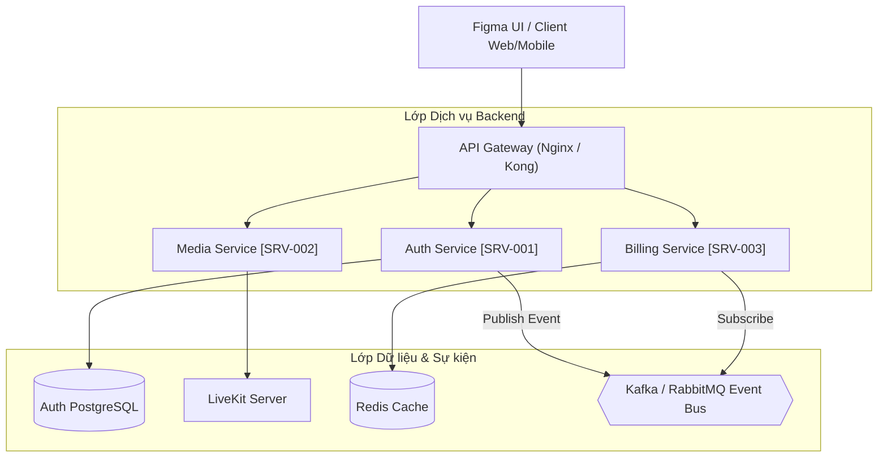
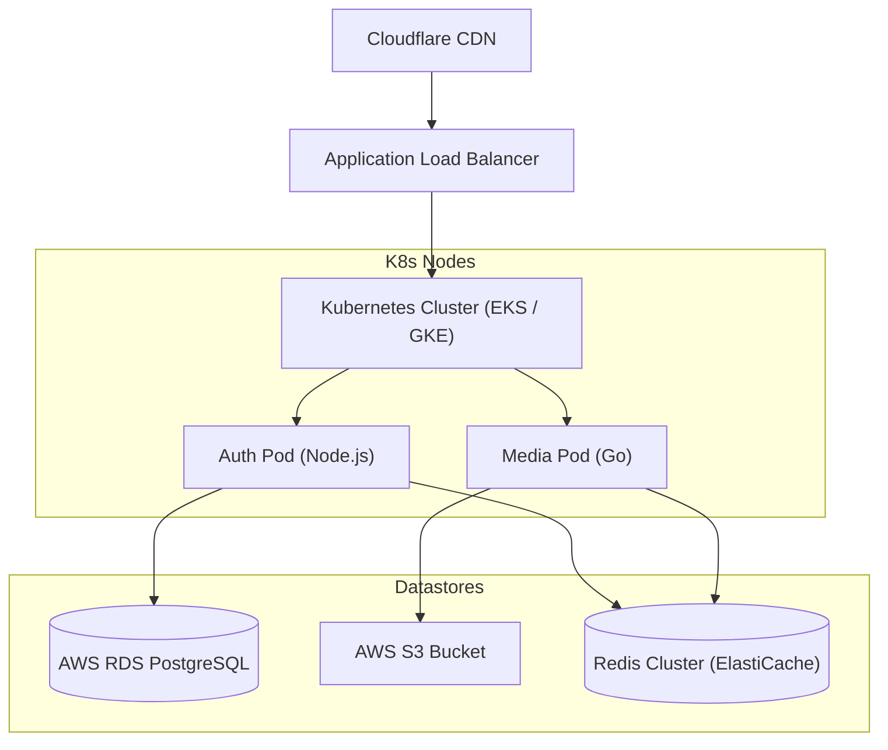
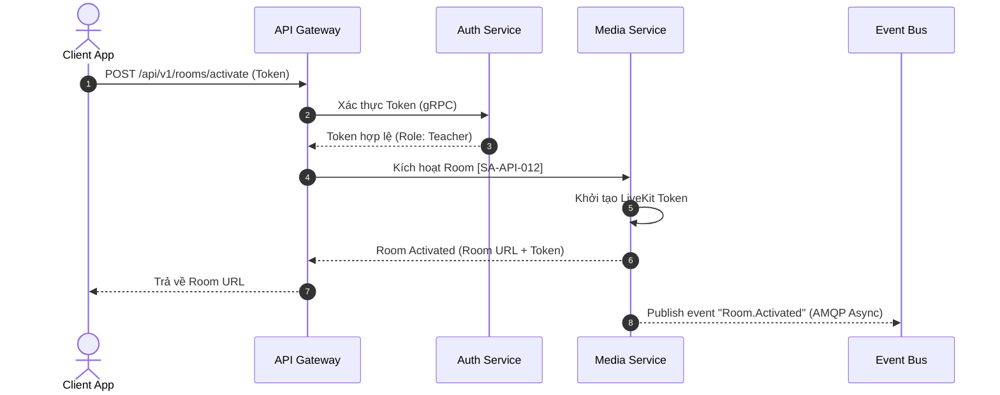

# High-Level Design Specification: [Tên Hệ Thống / Phân Hệ]

## 0. Tóm Tắt Thiết Kế (Design Summary)

*   **Hệ thống mục tiêu**: [Ví dụ: Hệ thống LMS học trực tuyến EduMeet]
*   **Kiến trúc chủ đạo**: Microservices | Monolith | Event-driven | Serverless
*   **Trình bày sơ đồ**: Mermaid.js (Component, Sequence, Deployment diagrams)
*   **Chủ sở hữu**: arch_agent

---

## 1. Sơ đồ Kiến trúc Tổng thể (Architecture Diagram)

Mô tả trực quan cấu trúc các lớp (layers) của hệ thống bằng sơ đồ Mermaid.js.

### 1.1 Sơ đồ Component Kiến trúc (Architecture Component Diagram)



### 1.2 Thuyết minh Kiến trúc (Architectural Narrative)
*   **Client Tier**: [Web app Next.js, Mobile app Flutter tương tác qua REST API/WebSockets]
*   **Gateway Tier**: [Đóng vai trò định tuyến, rate limiting, authentication filtering]
*   **Logic Tier (Services)**: [Phân rã chức năng thành các service độc lập. Ranh giới service tham chiếu đến các thực thể `SRV`]
*   **Data Tier**: [Mô hình hóa lưu trữ, cơ sở dữ liệu quan hệ kết hợp caching]

### 1.3 Sơ đồ Triển khai Vật lý (Deployment Diagram)

Mô tả cách phân bổ tài nguyên hạ tầng và môi trường deploy vật lý:



---

## 2. Bản đồ Dịch vụ, Topology & Observability (Topology & Observability)

Định nghĩa chi tiết ranh giới dịch vụ, giao thức liên lạc và phương án giám sát vận hành.

### 2.1 Ma trận Topology cho Human
| ID Dịch Vụ | Tên Dịch Vụ | Giao thức Giao tiếp (Protocol) | Database liên quan (DB Spec) | Trách nhiệm chính |
| :--- | :--- | :--- | :--- | :--- |
| `ARCH-SRV-[PROJ]-AUTH-001` | Auth Service | HTTP REST / gRPC | `BE-DB-[PROJ]-AUTH-001` | Quản lý User Session, RBAC |
| `ARCH-SRV-[PROJ]-MEDIA-002` | Media Service | WebRTC / WebSocket | Cloud Storage S3 | Live streaming, Zoom clone room |
| `ARCH-SRV-[PROJ]-BILL-003` | Billing Service | HTTP REST / AMQP | `BE-DB-[PROJ]-BILL-001` | Invoice generation, Payment gateway |

### 2.2 Machine-Readable Service Topology (YAML)
```yaml
topology:
  services:
    - id: ARCH-SRV-[PROJECT]-AUTH-001
      protocols: [http, grpc]
      datastores: [BE-DB-[PROJECT]-AUTH-001]
    - id: ARCH-SRV-[PROJECT]-MEDIA-002
      protocols: [webrtc, websocket]
      datastores: [aws_s3]
    - id: ARCH-SRV-[PROJECT]-BILL-003
      protocols: [http, amqp]
      datastores: [BE-DB-[PROJECT]-BILL-001]
```

### 2.3 Chiến lược Giám sát Vận hành (Observability Strategy)
*   **Thu thập Metrics**: [Sử dụng Prometheus quét các endpoints `/metrics` của dịch vụ và lưu trữ dữ liệu dạng time-series]
*   **Traces & Logs (Distributed Tracing)**: [OpenTelemetry APM tích hợp vào dịch vụ để theo dõi request span chéo dịch vụ, xuất dữ liệu ra Jaeger / OpenSearch]
*   **Dashboard & Alerts**: [Sử dụng Grafana để hiển thị trực quan hóa CPU/Memory, API Latency (p99), và cấu hình AlertManager gửi cảnh báo Slack/Email khi xảy ra Incident `INC`]

---

## 3. Thiết kế Luồng Dữ liệu Chính Chéo Dịch Vụ (Cross-Service Request Flows)

Mô tả trình tự tương tác (Sequence Diagram) của các use-cases cốt lõi đi qua nhiều services:

### 3.1 Luồng Nghiệp vụ 1: Đăng ký & Kích hoạt Room (Room Activation Flow)



---

## 4. Tác Động Triển Khai (Implementation Impact Matrix)

Danh sách các tài liệu kỹ thuật chi tiết kế thừa thiết kế HLD này:

### 4.1 Bảng Mapping Tác Động cho Human
| Thực thể bị ảnh hưởng | ID Tài liệu liên quan | Trạng thái dự kiến |
| :--- | :--- | :--- |
| **API Contracts** | `BE-API-[PROJECT]-[COMPONENT]-[NUMBER]` | Tạo mới API cho activation room |
| **DB Schemas** | `BE-DB-[PROJECT]-[COMPONENT]-[NUMBER]` | Thêm bảng Room Session |
| **Tasks** | `PM-TSK-[PROJECT]-[COMPONENT]-[NUMBER]` | Phân rã task phát triển backend/frontend |
| **Runbooks** | `DEVOPS-RUN-[PROJECT]-[COMPONENT]-[NUMBER]` | Cấu hình LiveKit Server deployment |

### 4.2 Machine-Readable Impact Links (YAML)
```yaml
impact_analysis:
  produces:
    - target: BE-API-[PROJECT]-[COMPONENT]-[NUMBER]
    - target: BE-DB-[PROJECT]-[COMPONENT]-[NUMBER]
    - target: PM-TSK-[PROJECT]-[COMPONENT]-[NUMBER]
    - target: DEVOPS-RUN-[PROJECT]-[COMPONENT]-[NUMBER]
```

---

## 5. Bảng Tự Kiểm Tra Chất Lượng HLD (HLD Quality Checklist)

- [ ] Sơ đồ Mermaid Component Diagram hiển thị rõ ranh giới các `SRV`.
- [ ] Tích hợp Sơ đồ Triển khai Vật lý (Deployment Diagram) ở Mục 1.3.
- [ ] Ma trận Service Topology định nghĩa đầy đủ giao thức giao tiếp bằng cả bảng Human và YAML block.
- [ ] Xây dựng Chiến lược Giám sát (Observability Strategy) chi tiết ở Mục 2.3.
- [ ] Có ít nhất 1 sơ đồ Sequence Diagram mô tả luồng dữ liệu chéo dịch vụ với cú pháp Mermaid chuẩn xác (`-->>` async).
- [ ] Khai báo đầy đủ mối quan hệ `produces` trỏ tới các technical artifacts cấp dưới ở Section 4.2.
- [ ] Đã liên kết đầy đủ các links `implements` trỏ tới `REQ` nghiệp vụ lớn và `adheres_to` trỏ tới `NFR`.
- [ ] Không có liên kết nào bị Orphan hoặc Broken Reference.
- [ ] **Architecture Check**: Đảm bảo không có SPOF (Single Point of Failure) không được giải trình.
- [ ] **Architecture Check**: Ranh giới Service Boundaries không bị tight coupling bất thường.
- [ ] **Architecture Check**: Các lệnh gọi đồng bộ cross-service (sync calls) không tạo ra chuỗi trễ (latency chain) nghiêm trọng.