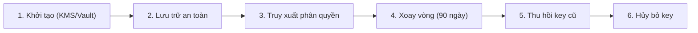
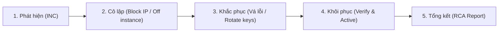

> **Status**: CANONICAL_TEMPLATE
> **Version**: SEC_TEMPLATE_V1.0
> **Compatibility**: MDS >= 1.0

# Security & Threat Model Specification: [Tên Hệ Thống / Phân Hệ]

## 0. Tóm Tắt An Ninh Hệ Thống (Security Summary)

*   **Chuẩn bảo mật áp dụng**: OWASP ASVS v4.0 (Level 2) | CIS Benchmarks | GDPR | PCI-DSS
*   **Cơ chế xác thực & phân quyền**: OAuth2 / OIDC (JWT) | Role-Based Access Control (RBAC)
*   **Tiêu chuẩn mã hóa**: TLS 1.3 (Transit) | AES-256 (At-Rest) | Argon2id / bcrypt (Hashing)
*   **Chủ sở hữu**: arch_agent

---

## 1. Sơ đồ mô hình hóa đe dọa bảo mật (Threat Model Diagram - STRIDE)

Phân tích các ranh giới tin cậy (Trust Boundaries) và các mối đe dọa tiềm tàng.

### 1.1 Sơ đồ dòng dữ liệu bảo mật (Security Data Flow Diagram)

```mermaid
graph TD
    User["Người dùng (Chưa xác thực)"] -- 1. POST /api/v1/auth/login --> Gateway["API Gateway (SSL Termination)"]
    
    subgraph Trust Boundary: Private Network [Vùng mạng nội bộ an toàn]
        Gateway -- 2. Forward request --> AuthSrv["Auth Service [SRV-001]"]
        AuthSrv -- 3. Query credentials --> AuthDB[("PostgreSQL (Encrypted-at-Rest)")]
    end
    
    Gateway -. 4. Blocked (Unauthorized Request) .-> Attack["Kẻ tấn công (External Agent)"]
    
    classDef trust fill:#d4edda,stroke:#28a745,stroke-width:2px;
    classDef untrust fill:#f8d7da,stroke:#dc3545,stroke-width:2px;
    class AuthSrv,AuthDB,Gateway trust;
    class User,Attack untrust;
```

### 1.2 Phân tích mối đe dọa theo STRIDE (STRIDE Threat Analysis)

Đánh giá rủi ro theo công thức: **Risk Score = Likelihood (Khả năng: 1-5) × Impact (Mức độ: 1-5)**.
*Phân cấp Score*: 1–5: Low | 6–12: Medium | 13–19: High | 20–25: Critical.

| Threat ID | Phân loại (STRIDE) | Thành phần bị tấn công | Mô tả chi tiết đe dọa | L (1-5) | I (1-5) | Score | Giải pháp giảm thiểu (Mitigation) |
| :--- | :--- | :--- | :--- | :---: | :---: | :---: | :--- |
| `T-001` | **S**poofing (Giả mạo) | Client App ➔ Gateway | Kẻ tấn công giả mạo token của người dùng hợp lệ để gọi API. | 4 | 5 | **20** | Sử dụng chữ ký JWT có thuật toán RS256 kết hợp rotation keys định kỳ. |
| `T-002` | **T**ampering (Chỉnh sửa) | Gateway ➔ Auth Service | Chặn luồng dữ liệu trên đường truyền để chỉnh sửa payload. | 2 | 4 | **8** | Bắt buộc SSL/TLS 1.3 cho toàn bộ lưu lượng mạng nội bộ (mTLS). |
| `T-003` | **I**nformation Disclosure | Database | SQL Injection / Rò rỉ dữ liệu nhạy cảm ra log. | 3 | 5 | **15** | Sử dụng ORM (Prisma), parameterized queries, và filter nhạy cảm ở log pipeline. |
| `T-004` | **D**enial of Service | API Gateway | Tấn công DDoS làm tê liệt Gateway. | 4 | 4 | **16** | Cấu hình WAF, Rate Limiting (giới hạn IP), và Cloudflare DDoS protection. |

---

## 2. Danh sách rủi ro an ninh & Kế hoạch giảm thiểu (OWASP Top 10 Mapping)

Ánh xạ trực tiếp các rủi ro hệ thống với OWASP Top 10 - 2021:

| Mã OWASP | Tên rủi ro an ninh | Kịch bản đe dọa thực tế | Thiết kế giảm thiểu (Defensive Design) |
| :--- | :--- | :--- | :--- |
| **A01:2021** | Broken Access Control | Người dùng sửa ID trên URL để xem dữ liệu của người khác (IDOR). | Kiểm tra Object-Level Authorization Check ở tầng Controller. |
| **A02:2021** | Cryptographic Failures | Lưu trữ thông tin nhạy cảm dạng text thô hoặc hash yếu (MD5/SHA1). | Sử dụng Argon2id / bcrypt để hash password. Mã hóa AES-256 cho PII. |
| **A03:2021** | Injection | Kẻ tấn công inject mã SQL qua input form để bypass màn hình login. | Prepared statements, input validation nghiêm ngặt qua JSON schema. |
| **A04:2021** | Insecure Design | Thiết kế luồng nghiệp vụ cho phép bypass xác thực đa nhân tố (2FA). | Áp dụng threat modeling ở Phase 3 trước khi code, bắt buộc 2FA ở core flow. |
| **A05:2021** | Security Misconfiguration | Bật chế độ debug ở Production lộ thông tin stack trace. | Tắt debug mode ở prod configs, cấu hình default-deny cho network. |
| **A06:2021** | Vulnerable Components | Sử dụng các thư viện open-source lỗi thời có CVE bảo mật cao. | Tích hợp quét dependency vulnerability hàng tuần trong CI/CD pipeline. |
| **A07:2021** | Identification/Auth Failures | Kẻ tấn công brute-force để đoán mật khẩu người dùng hoặc token session. | Khóa tài khoản sau 5 lần nhập sai, sử dụng token JWT ngắn hạn (< 15 phút). |
| **A08:2021** | Software/Data Integrity | Chấp nhận deserialize dữ liệu untrusted từ client mà không verify. | Sử dụng chữ ký số hoặc mã hóa HMAC đối với các payload quan trọng. |
| **A09:2021** | Security Logging Failures | Không ghi log lỗi đăng nhập thất bại dẫn đến không phát hiện brute-force. | Thiết lập Security Audit Log và alert realtime cho các hành vi bất thường. |
| **A10:2021** | SSRF | API cho phép user nhập URL tự do và backend fetch URL đó (SSRF). | Whitelist domain được phép fetch, cấu hình cô lập network cho backend node. |

---

## 3. Xác thực, Phân quyền & Giám sát An ninh (Identity, Access & Audit)

### 3.1 Cấu trúc Token (JWT Payload Specification)
```json
{
  "iss": "https://auth.edumeet.vn",
  "sub": "user_123456789",
  "role": "TEACHER",
  "permissions": ["room:create", "room:join", "media:publish"],
  "exp": 1783000000
}
```

### 3.2 Ma trận phân quyền (RBAC Matrix)

| Vai trò (Role) | Tài nguyên (Resource) | Quyền hạn (Action) | Điều kiện áp dụng (Conditions) |
| :--- | :--- | :--- | :--- |
| `TEACHER` | `Room` | `Create`, `Join`, `Publish` | Room owner (Chủ phòng) |
| `STUDENT` | `Room` | `Join` | Được mời qua Room ID |
| `ADMIN` | `System` | `All` | Toàn quyền quản trị |

### 3.3 Machine-Readable Access Control Policy (YAML)
```yaml
access_control:
  mechanism: RBAC
  roles:
    TEACHER:
      permissions:
        - resource: room
          actions: [create, join, delete]
          condition: is_owner
    STUDENT:
      permissions:
        - resource: room
          actions: [join]
          condition: is_invited
```

### 3.4 Chính sách quản lý bí mật & Vòng đời (Secret Management & Lifecycle)



```yaml
secret_lifecycle:
  rotation_days: 90
  emergency_rotation: true          # Kích hoạt xoay vòng khẩn cấp khi phát hiện rò rỉ
  revoke_on_breach: true            # Hủy bỏ quyền truy cập ngay khi phát hiện sự cố
  storage_provider: aws_kms         # AWS KMS / HashiCorp Vault
```

### 3.5 Ghi nhật ký giám sát an ninh (Security Audit Logging Schema)

Machine-readable log schema bắt buộc cho Audit Trail:

```yaml
audit_log_schema:
  properties:
    timestamp: ISO8601              # YYYY-MM-DDTHH:mm:ss.sssZ
    actor_id: string                # ID người dùng hoặc Agent thực thi
    action: string                  # Ví dụ: login, delete_account, access_secret
    resource: string                # Tên tài nguyên bị tác động
    result: SUCCESS | FAIL
    ip_address: string              # IP client gửi request
    user_agent: string              # Thiết bị/trình duyệt
    trace_id: string                # ID theo vết request chéo dịch vụ
```

---

## 4. Phân loại Dữ liệu & Tuân thủ (Data Classification & Compliance)

### 4.1 Ma trận phân loại dữ liệu & Vòng đời lưu trữ (Data Classification & Retention)

*Retention Policy wording*: Thời gian lưu trữ phụ thuộc vào loại token/secret, cấm mặc định vĩnh viễn cho tất cả RESTRICTED secrets.

| Lớp dữ liệu (Class) | Ví dụ dữ liệu | Yêu cầu Mã hóa (Encryption) | Thời hạn lưu trữ (Retention) | Chính sách Truy cập |
| :--- | :--- | :--- | :--- | :--- |
| **RESTRICTED** | Mật khẩu hash, Secrets Keys | Hashing Argon2id / AES-256 | Theo vòng đời key (Revoke/Rotate), cấm lưu vĩnh viễn | Chỉ System Core APM được đọc |
| **CONFIDENTIAL** | Email, Số điện thoại, Hóa đơn | Mã hóa AES-256 trong Database | 5 năm kể từ khi đóng tài khoản | Chỉ Owner và Admin được xem |
| **INTERNAL** | System Logs, Metadata | Không mã hóa / Mã hóa ổ đĩa | 365 ngày (Log audit) | Toàn bộ thành viên dự án |
| **PUBLIC** | Avatar, Mô tả Room | Không mã hóa | Không giới hạn | Truy cập tự do qua Internet |

```yaml
retention_policy:
  restricted_secrets: rotated_keys_30d_session_7d
  audit_logs: 365d
  pii: 5y
  session_tokens: 7d
```

### 4.2 Khung tuân thủ an ninh & Control Mapping (Compliance Matrix)

```yaml
compliance_mapping:
  standards:
    - id: GDPR-ART-17
      requirement: "Right to Erasure (Quyền được xóa dữ liệu)"
      implemented_by:
        - BE-API-[PROJECT]-AUTH-005      # API Endpoint thực hiện xóa tài khoản vĩnh viễn
    - id: SOC2-CC-6.1
      requirement: "Access Control Infrastructure"
      implemented_by:
        - ARCH-SEC-[PROJECT]-AUTH-001    # SEC spec quy định RBAC matrix
    - id: PCI-DSS-REQ-3
      requirement: "Protect stored cardholder data"
      implemented_by:
        - BE-API-[PROJECT]-BILL-002      # Tích hợp cổng thanh toán Stripe, không lưu PAN
```

---

## 5. Xác thực Bảo mật, Cổng Kiểm Soát & Phản Ứng Sự Cố (Security Verification & Incident Response)

### 5.1 Kịch bản kiểm thử an ninh & Cổng Kiểm Soát (Security Verification & CI Gates)
*   **SAST**: Chạy Semgrep trong CI pipeline quét code lỗi bảo mật.
*   **Dependency Check**: `npm audit` quét thư viện lỗi thời.
*   **DAST**: Chạy OWASP ZAP định kỳ quét endpoint staging.
*   **Target Test Case ID**: `QA-TC-[PROJECT]-[COMPONENT]-[NUMBER]`

```yaml
security_verification:
  scenarios:
    - type: authorization_bypass_test
      target_endpoint: "/api/v1/rooms/delete"
      expected_status: 403
    - type: input_sanitization_test
      payload: "'; DROP TABLE Users; --"
      expected_status: 400
  target_tc:
    - QA-TC-[PROJECT]-[COMPONENT]-[NUMBER]

# Cổng kiểm soát tự động trong CI/CD Pipeline
security_gate:
  critical: block_release           # Phát hiện lỗi Critical -> chặn release
  high: require_approval            # Phát hiện lỗi High -> cần Human PM duyệt
  medium: warning                   # Phát hiện lỗi Medium -> cảnh báo
```

### 5.2 SLA phản ứng sự cố an ninh (Security Incident SLA)

Khi xảy ra sự cố an ninh, Security Agent và DevOps Agent bắt buộc phối hợp xử lý theo SLA cam kết dưới đây.

| Độ nghiêm trọng (Severity) | SLA phản hồi (Response) | SLA cô lập (Containment) | SLA khắc phục hoàn toàn |
| :--- | :---: | :---: | :---: |
| **CRITICAL** (Rò rỉ DB, DDoS sập hệ thống) | < 15 phút | < 1 giờ | < 4 giờ |
| **HIGH** (Bypass quyền hạn, lộ API Key test) | < 1 giờ | < 4 giờ | < 12 giờ |
| **MEDIUM** (Phát hiện CVE mới mức độ trung bình) | < 24 giờ | < 48 giờ | < 7 ngày |

```yaml
incident_sla:
  critical: 15m
  high: 1h
  medium: 24h
```

### 5.3 Quy trình phản ứng sự cố an ninh (Security Incident Response Workflow)



*   **Đầu ra bắt buộc**: 
    - Tạo Sự cố `DEVOPS-INC-[PROJECT]-[COMPONENT]-[NUMBER]` để phân tích nguyên nhân gốc rễ (RCA).
    - Tạo/Cập nhật Hướng dẫn vận hành `DEVOPS-RUN-[PROJECT]-[COMPONENT]-[NUMBER]` để cô lập và xử lý sự cố.

---

## 6. Sản Phẩm Bàn Giao Kế Thừa (MDS Deliverables Graph)

Quy chuẩn đầu ra của thực thể Security Specification này được biểu diễn thông qua các mối liên kết đồ thị tri thức hướng Outbound `produces` định nghĩa ở metadata Frontmatter:
*   `QA-TC-[PROJECT]-[COMPONENT]-[NUMBER]` (Kịch bản kiểm thử bảo mật).
*   `DEVOPS-RUN-[PROJECT]-[COMPONENT]-[NUMBER]` (Hướng dẫn vận hành an ninh).

---

## 7. Bảng Tự Kiểm Tra Chất Lượng SEC (Security Quality Checklist)

- [ ] Sơ đồ Security DFD thể hiện rõ ràng Trust Boundaries và luồng dữ liệu nhạy cảm.
- [ ] Bảng phân tích STRIDE chỉ rõ Likelihood, Impact, Risk Score và link tới giải pháp giảm thiểu.
- [ ] Ánh xạ đầy đủ 10 rủi ro hệ thống với ma trận OWASP Top 10 - 2021 (Section 2).
- [ ] Đặc tả rõ ràng chính sách Secret Lifecycle (3.4) và Audit Log Schema (3.5).
- [ ] Xây dựng Ma trận phân loại dữ liệu có đính kèm thời hạn lưu giữ Retention Policy (4.1).
- [ ] Thiết lập Compliance control mapping và cổng kiểm soát Security Gates (4.2 & 5.1).
- [ ] Quy chuẩn hóa SLA phản ứng sự cố an ninh Incident SLA (5.2).
- [ ] Đã khai báo liên kết graph edge `produces` trỏ tới các deliverables thực tế ở metadata Frontmatter (Links).
- [ ] Đã liên kết link `adheres_to` trỏ về `constraints.md` và `NFR`, `implements` trỏ về `REQ` nghiệp vụ.
- [ ] Đã liên kết link `tested_by` trỏ về Test Case `TC` an ninh (Khớp với links metadata).
- [ ] Không có liên kết nào bị Orphan hoặc Broken Reference.
- [ ] **Anti-Pattern Check**: Cấm lưu mật khẩu thô trong DB hoặc dùng MD5/SHA1 (bắt buộc bcrypt/Argon2id).
- [ ] **Anti-Pattern Check**: Cấm hardcode API keys, secrets, hay credentials trong mã nguồn (bắt buộc dùng Secrets Manager / Environment Variables).
- [ ] **Anti-Pattern Check**: Không có API public nào không áp dụng Rate Limiting / Authentication Filter mà không được giải trình.
- [ ] **Anti-Pattern Check**: Đảm bảo đã chạy Penetration Test / Red Team simulation đối với các cấu phần CRITICAL.
- [ ] **Anti-Pattern Check**: Mọi lỗ hổng mức CRITICAL/HIGH được phát hiện đều bắt buộc phải có Remediation Plan đi kèm.