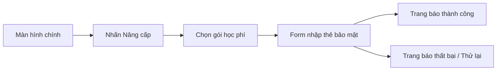

> **Status**: CANONICAL_TEMPLATE
> **Version**: REQ_TEMPLATE_V1.1
> **Compatibility**: MDS >= 1.0
>
> **BA Layer Traceability**:
> `BRD ── produces ──► {REQ, BR, FLOW, UC}`
> `REQ ── adheres_to ─► BR`
> `FLOW ─ elaborates ─► REQ`
> `UC ─── elaborates ─► REQ`
> `TC ─── verifies ──► {REQ, BR, FLOW, UC}`

# Functional Requirement Spec: [Tên Yêu Cầu Chức Năng]

## 0. Tóm Tắt Yêu Cầu (Requirement Summary)

*   **Mục tiêu tính năng (Goal)**: [Ví dụ: Cung cấp khả năng thanh toán học phí tự động cho học viên thông qua thẻ tín dụng].
*   **Tác nhân chính (Primary Actor)**: Học viên (Student)
*   **Độ ưu tiên yêu cầu**: **MUST HAVE** (Bắt buộc phải có trong phiên bản này) | **SHOULD HAVE** (Nên có) | **COULD HAVE** (Có thể có) | **WON'T HAVE** (Dời sang tương lai / out-of-scope for this release)
*   **Chủ sở hữu**: ba_agent

---

## 1. Đặc tả Chức năng Chi tiết & User Stories (Functional Specs)

Mô tả các tính năng con và kịch bản sử dụng dưới góc nhìn người dùng (User Stories):

### 1.1 Danh sách tính năng con (Sub-features)
*   **`FEAT-001`**: Nhập thông tin thẻ và lưu trữ token bảo mật.
*   **`FEAT-002`**: Thực hiện trừ tiền tự động theo hóa đơn định kỳ.

### 1.2 User Stories

| ID | Vai trò (As a) | Mong muốn (I want to) | Lợi ích (So that) | Tiêu chí nghiệm nghiệm thu chức năng (Acceptance Criteria) |
| :--- | :--- | :--- | :--- | :--- |
| `US-001` | Học viên | Lưu thông tin thẻ thanh toán vào tài khoản. | Không cần nhập lại thẻ cho lần thanh toán sau. | Hệ thống lưu trữ Token thẻ an toàn từ Cổng thanh toán, hiển thị 4 số cuối của thẻ trên giao diện profile. |
| `US-002` | Học viên | Nhận hóa đơn điện tử tự động sau khi thanh toán. | Có chứng từ đối soát học phí. | Hệ thống gửi email chứa hóa đơn PDF trong vòng 30 giây kể từ khi nhận callback thanh toán thành công. |

---

## 2. Quy tắc Nghiệp vụ & Luồng xử lý áp dụng (Governing Rules & Flows)

Yêu cầu chức năng này chịu sự chi phối và được làm rõ bởi các thực thể nghiệp vụ khác:

*   **Quy tắc nghiệp vụ tuân thủ (Outbound Adheres-to Relation)**:
    - `adheres_to` ➔ [BA-BR-[PROJECT]-BILL-005](file:///d:/HoangDang/IT/MDS%20(Master%20Documentation%20System)/mds-core/templates/ba/business_rule_template.md) (Luật chiết khấu tự động).
*   **Được làm rõ bởi quy trình nghiệp vụ (Inbound Elaborate Relation - Phản ánh từ FLOW)**:
    - Từng bước thực hiện của tính năng này được định nghĩa tại [BA-FLOW-[PROJECT]-BILL-001](file:///d:/HoangDang/IT/MDS%20(Master%20Documentation%20System)/mds-core/templates/ba/process_flow_template.md) (Luồng thanh toán học phí).
*   **Được làm rõ bởi kịch bản tương tác (Inbound Elaborate Relation - Phản ánh từ UC)**:
    - Luồng tương tác người dùng - hệ thống chi tiết tại [BA-UC-[PROJECT]-BILL-001](file:///d:/HoangDang/IT/MDS%20(Master%20Documentation%20System)/mds-core/templates/ba/use_case_template.md) (Use Case đặt mua gói dịch vụ).

---

## 3. Đặc tả Giao diện & Trải nghiệm (UI/UX Wireframe Specs)

*   **Đường dẫn thiết kế (Design Reference Link)**: Tách biệt dạng YAML `design_references` ở Frontmatter.
*   **Sơ đồ luồng giao diện (User Interface Flow)**:



---

## 4. Tham số Dữ liệu & Sự kiện CQRS (CQRS Data & Event Schema YAML)

Khối cấu trúc YAML machine-readable định nghĩa các lệnh (Commands), truy vấn (Queries), và sự kiện hệ thống (Events):

```yaml
requirement_data:
  requirement_id: BA-REQ-[PROJECT]-[COMPONENT]-[NUMBER]
  data_model:
    fields:
      - name: payment_method_token
        type: string
        required: true
        description: Token bảo mật của thẻ do cổng thanh toán cấp.
      - name: coupon_code
        type: string
        required: false
        description: Mã giảm giá áp dụng.
  commands:
    - command_name: create_order
      parameters: [user_id, package_id, coupon_code]
  queries:
    - query_name: get_order_status
      parameters: [order_id]
      returns: [status, billing_date]
  events:
    - event_name: order.created
      trigger: Người dùng xác nhận thanh toán thành công.
      payload_properties: [order_id, user_id, amount]
    - event_name: payment.failed
      trigger: Cổng thanh toán từ chối giao dịch.
      payload_properties: [order_id, error_code, retry_count]
```

### 4.1 Ma trận nghiệm thu chức năng (Acceptance Test Matrix YAML)
Khối dữ liệu QA/Automation test case machine-readable phác thảo kịch bản nghiệm thu:

```yaml
acceptance_tests:
  - scenario_id: TC-001-happy-payment
    description: Thanh toán hóa đơn thành công bằng thẻ hợp lệ.
    inputs:
      payment_method_token: "tok_visa_valid"
      coupon_code: null
    expected:
      invoice_status: PAID
      account_tier: VIP
  - scenario_id: TC-002-declined-payment
    description: Thanh toán hóa đơn thất bại do thẻ bị từ chối.
    inputs:
      payment_method_token: "tok_visa_declined"
      coupon_code: null
    expected:
      invoice_status: FAILED
      account_tier: FREE
```

---

## 5. Bảng Tự Kiểm Tra Chất Lượng REQ (Requirement Quality Checklist)

- [ ] Quy định cụ thể mục tiêu tính năng (Goal) và tác nhân chính ở Mục 0.
- [ ] Phân định rõ ràng `document_priority` (độ khẩn cấp tài liệu) và `moscow_priority` (mức độ ưu tiên yêu cầu).
- [ ] Khai báo cấu trúc Figma `design_references` dạng YAML metadata ở Frontmatter.
- [ ] Điền đầy đủ thông tin chuỗi phê duyệt (reviewed_by, approved_by, approved_at) ở Frontmatter.
- [ ] Viết đầy đủ danh sách tính năng con (Sub-features) và User Stories có tiêu chí nghiệm thu rõ ràng (Mục 1).
- [ ] Phân biệt rõ ràng quan hệ Adheres-to (Outbound) và Elaborate (Inbound) ở Mục 2.
- [ ] Tích hợp sơ đồ luồng giao diện trực quan (UI Flow) bằng Mermaid.js ở Mục 3.
- [ ] Cấu hình khối YAML `requirement_data` machine-readable theo chuẩn CQRS (Commands, Queries, Events) ở Mục 4.
- [ ] Cấu hình khối YAML `acceptance_tests` phác thảo test vectors cho QA/Automation ở Mục 4.1.
- [ ] Đã liên kết đầy đủ các links `implements` trỏ về `BRD`, `adheres_to` trỏ về `CONSTRAINTS` & `BR`, và `tested_by` trỏ về `TC` tương ứng.
- [ ] Không có liên kết nào bị Orphan hoặc Broken Reference.
- [ ] **Anti-Pattern Check**: Yêu cầu chức năng độc lập hoàn toàn với nền tảng cài đặt (không ghi nhận PostgreSQL DB schema, Stripe Webhook Endpoint implementation details - No Tech Leakage).
- [ ] **Anti-Pattern Check**: Yêu cầu không chứa các từ ngữ mơ hồ ("fast", "easy-to-use", "stable") mà không có tiêu chí nghiệm thu định lượng cụ thể.
