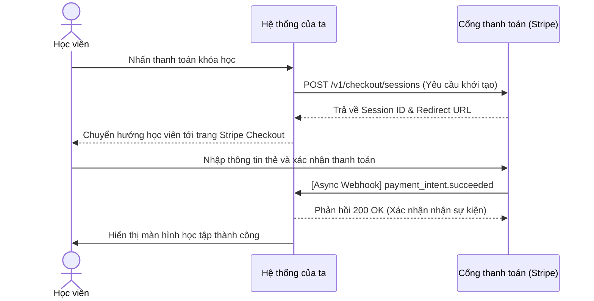

> **Status**: CANONICAL_TEMPLATE
> **Version**: INT_TEMPLATE_V1.1
> **Compatibility**: MDS >= 1.0
>
> **MDS BE Integration Traceability**:
> `BA-REQ ── implemented_by ─► BE-INT`
> `BE-INT ── adheres_to ─────► ARCH-ADR`
> `QA-TC  ── verifies ───────► BE-INT`

# Integration Specification: [Tên Hệ Thống Thứ Ba]

## 0. Tổng Quan Tích Hợp (Integration Overview)

*   **Đối tác tích hợp (Partner)**: Stripe | Twilio | SendGrid
*   **Giao thức kết nối (Protocol)**: HTTPS REST | gRPC | SOAP | Webhook
*   **Cơ chế xác thực (Authentication)**: OAuth 2.0 Client Credentials | API Key | HMAC Webhook Signature
*   **Rate Limits của đối tác**: Max 25 requests / second
*   **Cam kết dịch vụ (SLA)**: Uptime >= 99.9%
*   **Đường dẫn kết nối (Environment URLs)**:
    - **Sandbox (Staging)**: `https://api.sandbox.partner.com/v1`
    - **Production**: `https://api.partner.com/v1`

---

## 1. Sơ Đồ Bắt Tay Tích Hợp (Handshake Sequence Diagram)

Sơ đồ tuần tự thể hiện luồng giao dịch, gọi API và cơ chế Webhook Callback:



---

## 2. Đặc Tả Dữ Liệu Tích Hợp (Payload Specification)

### 2.1 Outbound Request (Yêu cầu gửi đi)
*   **Endpoint**: `POST /v1/checkout/sessions`
*   **Request Headers**:
    - `Authorization`: `Bearer sec_key_placeholder`
    - `Content-Type`: `application/json`
*   **Request Payload**:
```json
{
  "amount": 25000,
  "currency": "vnd",
  "metadata": {
    "student_id": "std_001",
    "course_id": "crs_102"
  }
}
```

### 2.2 Inbound Response (Phản hồi nhận về)
*   **HTTP Status**: `200 OK`
*   **Response Payload**:
```json
{
  "session_id": "sess_9a8b7c6d5e",
  "payment_status": "unpaid",
  "url": "https://checkout.stripe.com/pay/sess_9a8b7c6d5e"
}
```

### 2.3 Callback / Webhook Payload (Đối tác gọi về)
*   **Webhook Endpoint của ta**: `POST /webhooks/stripe/payment`
*   **Webhook Headers**:
    - `Stripe-Signature`: `t=1672531199,v1=sha256_hash_placeholder` (Dùng đối soát chữ ký HMAC)
*   **Webhook Payload**:
```json
{
  "event_id": "evt_123456",
  "type": "payment_intent.succeeded",
  "data": {
    "amount": 25000,
    "currency": "vnd",
    "metadata": {
      "student_id": "std_001",
      "course_id": "crs_102"
    }
  }
}
```

---

## 3. Chính Sách Kháng Lỗi, Chịu Tải & Khử Trùng (Resilience & Deduplication)

### 3.1 Chính sách Thử lại (Retry Policy)
*   **Cơ chế**: Exponential Backoff (Thử lại tăng dần thời gian).
*   **Số lần thử lại tối đa (Max Attempts)**: 5 lần.
*   **Thời gian trễ ban đầu (Initial Delay)**: 500 ms (hệ số nhân 2.0).

### 3.2 Cơ chế Ngắt mạch (Circuit Breaker)
*   **Ngưỡng lỗi (Failure Rate Threshold)**: 50% tổng số cuộc gọi bị fail trong cửa sổ trượt (sliding window) 20 requests.
*   **Thời gian ngắt (Trip Open Duration)**: 60 seconds (Hệ thống tự động chuyển sang Half-Open để kiểm tra lại đối tác).

### 3.3 Quy định Giới hạn thời gian (Timeout Policy)
*   **Connection Timeout**: 3000 ms (Thời gian thiết lập kết nối tối đa).
*   **Read Timeout**: 10000 ms (Thời gian chờ đối tác xử lý payload tối đa).

### 3.4 Khử trùng Sự kiện Webhook (Webhook Deduplication)
*   **Chiến lược khử trùng (Deduplication Strategy)**: Sử dụng trường `event_id` làm khóa độc bản lưu trữ trong Redis Cache.
*   **Thời gian lưu khóa (TTL)**: 86400 seconds (24 Hours).
*   **Hành vi**: Nếu phát hiện trùng lặp `event_id` trong vòng 24 giờ, hệ thống lập tức trả về `200 OK` mà không thực hiện lại logic trừ tiền học viên.

### 3.5 Cơ chế Queue Lỗi & Fallback (DLQ & Fallback)
*   **Dead Letter Queue (DLQ)**: Nếu thử lại 5 lần thất bại, request được đẩy vào `partner_payment_dlq` để đối soát thủ công.
*   **Hành vi Fallback**: Khi kết nối bị đứt, hiển thị thông báo "Cổng thanh toán đang bảo trì, vui lòng thử lại sau" và gửi email ghi nhận đơn hàng tạm hoãn cho PO.

---

## 4. Khối Cấu Hình Tích Hợp YAML (Machine-Readable Integration Config)

Khối YAML mô tả logic tích hợp giúp AI Agents tự sinh middleware và cấu hình Resilience tự động:

```yaml
integration_contract:
  schema_version: MDS-BE-INT-1.0
  style: REST
  partner: Stripe
  connection:
    sandbox_url: https://api.sandbox.partner.com/v1
    production_url: https://api.partner.com/v1
    timeout:
      connect_ms: 3000
      read_ms: 10000
  resilience:
    retry:
      enabled: true
      max_attempts: 5
      backoff: exponential
      initial_delay_ms: 500
      multiplier: 2.0
    circuit_breaker:
      enabled: true
      failure_rate_threshold: 0.5
      sliding_window_size: 20
      open_timeout_seconds: 60
    dlq:
      enabled: true
      queue_name: partner_payment_dlq
  deduplication:
    strategy: event_id
    ttl_seconds: 86400
  endpoints:
    outbound:
      - name: create_checkout_session
        method: POST
        path: /v1/checkout/sessions
        auth_type: api_key
    inbound_webhook:
      - name: stripe_payment_webhook
        method: POST
        path: /webhooks/stripe/payment
        signature_header: Stripe-Signature
```

---

## 5. Bảng Tự Kiểm Tra Chất Lượng Tích Hợp (Integration Validation Checklist)

- [ ] ID thực thể đúng chuẩn `BE-INT-[PROJECT]-[COMPONENT]-[NUMBER]` hoặc `CORE-BE-INT-[NAME]-V[VERSION]`.
- [ ] Khai báo thuộc tính `integration_style` đầy đủ ở Frontmatter.
- [ ] Link `implements` trỏ chính xác về Functional Requirement (`BA-REQ`) liên quan.
- [ ] Tích hợp sơ đồ Sequence bắt tay tích hợp (Mục 1) bằng Mermaid.js mô tả rõ Client, App, và Partner.
- [ ] Thiết kế đầy đủ ví dụ Outbound Request, Inbound Response, và Webhook Callback (Mục 2).
- [ ] Đặc tả chi tiết chính sách kháng lỗi (Retry attempts, Circuit breaker thresholds, Timeout connect/read).
- [ ] Định nghĩa rõ chiến lược khử trùng sự kiện Webhook (Deduplication event_id) và TTL trong 24h.
- [ ] Định nghĩa cơ chế Dead Letter Queue (DLQ) và Fallback khi đứt kết nối đối tác.
- [ ] Khối YAML `integration_contract` máy đọc được biên dịch hợp lệ không chứa Tab và đúng cấu trúc resilience.
- [ ] **Controlled Tech Leakage Check**: Cho phép rò rỉ sandbox URL, API parameters và các headers tích hợp nhưng cấm tuyệt đối rò rỉ API Production Key, Private Webhook Secrets, Client Secrets hoặc Tokens thật.