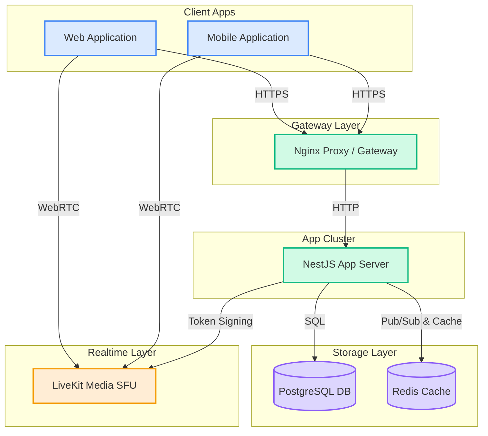
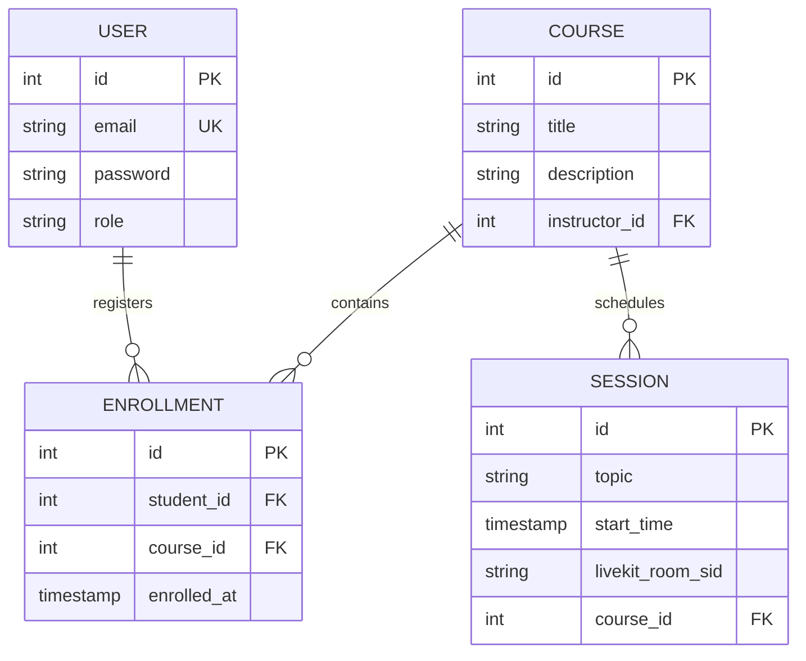

# LMS Case Study: EduMeet Realtime Platform

This case study shows how the System Engineering Copilot (AI-EOS) processes a raw requirement intake, computes confidence, selects execution paths, models databases, designs high-level architectures, and validates results.

---

## 1. Raw Input Intake (Phase 0)
* **User Input:** "I want to build an LMS named EduMeet. It needs live classes, student enrollment, courses, and chat. We are using NestJS, PostgreSQL, Redis, and LiveKit. It must support high traffic."

* **Intake Extraction:**
  - **Project Name:** EduMeet
  - **Goal:** Realtime LMS for live classes and interactive chats.
  - **Actors:** Student, Instructor, System Administrator.
  - **Constraints:** NestJS, PostgreSQL, Redis, LiveKit.
  - **Complexity Tier:** Enterprise (due to realtime video, concurrency, and caching requirements).

---

## 2. Confidence Evaluation & State Setup
- **Mandatory Fields:** `business_goal` (present), `actors` (present), `scope` (present).
- **Confidence Score:** 1.0 (Sufficient to generate).
- **State Initialization:**
  - Written to `state/project_context.yaml`:
    ```yaml
    project_name: EduMeet
    architecture: modular_monolith
    database: PostgreSQL
    cache: Redis
    realtime: LiveKit
    ```

---

## 3. Solution Architecture C4 Diagram (Phase 3)


---

## 4. Entity Relationship Diagram (Phase 2)


---

## 5. QA Architecture - Chaos Test Spec (Phase 6)
- **Failure Scenario:** Redis Cache disconnects during high-concurrency websocket room signaling.
- **Verification Strategy:**
  1. Trigger cache failure.
  2. Verify that NestJS App gracefully falls back to local memory queueing or returns rate-limiting responses instead of server crashes.
  3. Validate automatic reconnection mechanics of Redis client configurations.
