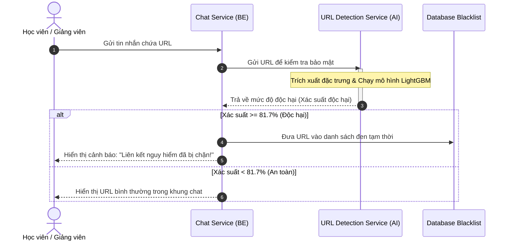

> **Status**: APPROVED
> **Version**: SRV_TEMPLATE_V1.3
> **Compatibility**: MDS >= 1.0

# Service Design Specification: URL Detection Model Training Service

Tài liệu này đặc tả chi tiết về dịch vụ huấn luyện, đánh giá và cấu hình mô hình học máy phát hiện URL độc hại (phishing, lừa đảo) sử dụng bộ phân loại **LightGBM**. Dịch vụ này đóng vai trò là lõi xử lý trí tuệ nhân tạo (AI Core) thuộc phân hệ bảo mật (`AI`) của dự án **EduMeet** (`EDU`), chịu trách nhiệm quét và cảnh báo các liên kết độc hại được chia sẻ trong phòng họp trực tuyến.

---

## 0. Bối Cảnh Nghiệp Vụ & Bài Toán Thực Tế (Business Context)

### 0.1 Mục tiêu nghiệp vụ (Business Goal)
Trong phần mềm học trực tuyến **EduMeet**, học viên và giảng viên thường xuyên chia sẻ các liên kết (URL) trong khung chat của phòng học (ví dụ: tài liệu học tập, slide bài giảng, link khảo sát). Kẻ xấu có thể lợi dụng phòng học để phát tán các URL độc hại (phishing, lừa đảo, trang giả mạo đăng nhập). Dịch vụ này được thiết kế để tự động quét, phát hiện và chặn các liên kết độc hại nhằm bảo vệ an toàn cho người dùng.

### 0.2 Luồng hoạt động tổng quan (Workflow Visualization)



---

## 1. Kiến Trúc Pipeline Tiền Xử Lý (Preprocessing & Feature Pipeline)

### 1.1 Trực quan hóa luồng xử lý dữ liệu (Data Pipeline)

Khi dịch vụ nhận được một URL thô (dạng chữ), dữ liệu sẽ đi qua các bước xử lý sau trước khi đưa vào mô hình LightGBM để dự đoán:

```text
                                         ┌──→ Trích xuất đặc trưng văn bản ──→ TF-IDF Vectorizer ──┐
URL thô (Dạng chữ) ──→ ColumnTransformer ┤                                                         ├──→ Ghép đặc trưng (Sparse Matrix) ──→ LightGBM
                                         └──→ Trích xuất đặc trưng số ──────→ StandardScaler ──────┘
```

### 1.2 Thiết kế kỹ thuật theo nguyên lý "Explain Before Formalize"

#### A. Bộ trích xuất đặc trưng văn bản (Text Features)

*   **1. Mục tiêu (What):** Biến đổi chuỗi ký tự của URL thành các vector số học đại diện để mô hình có thể hiểu và tính toán phân loại.
*   **2. Vấn đề cần giải quyết (Why):** URL không có khoảng trắng như một câu văn bình thường. Nếu sử dụng các bộ tách từ (tokenizer) thông thường, một URL như `paypal-login-security.xyz` sẽ bị xem là một từ duy nhất `["paypal-login-security.xyz"]`, điều này làm cho mô hình hoàn toàn không thể học được các mẫu từ khóa nhạy cảm bên trong.
*   **3. Ví dụ minh họa (Example):** Với URL `paypal-login-security.xyz`, ta chia nó thành các chuỗi ký tự liên tiếp nhỏ (n-gram) có độ dài từ 3 đến 5 ký tự như: `pay`, `ayp`, `ypa`, `pal`, `al-`, `log`, `ogi`, `gin`,... Những chuỗi con này giúp mô hình nhận diện ra các từ khóa nhạy cảm thường thấy trong phishing như `login`, `verify`, `paypal`, `bank`, `secure` dù chúng được viết liền hay chèn thêm ký tự lạ.
*   **4. Thiết kế/Giải pháp (How):** Sử dụng bộ trích xuất `TfidfVectorizer` của `scikit-learn` trên cột chứa chuỗi URL thô để cắt URL theo cấp độ ký tự (character level n-grams) và tính toán trọng số TF-IDF biểu diễn tầm quan trọng của n-gram đó.
*   **5. Cấu hình hoặc Thuật toán (Implementation):**
    ```python
    TfidfVectorizer(analyzer="char", ngram_range=(3, 5), min_df=2, max_features=5000)
    ```
*   **6. Kết quả và Lý do lựa chọn (Result & Rationale):** Việc giới hạn `max_features=5000` và `min_df=2` giúp loại bỏ hoàn toàn các cụm n-gram nhiễu (xuất hiện quá ít) và tránh bùng nổ chiều đặc trưng, giúp mô hình LightGBM chạy nhanh hơn và tránh quá khớp (overfitting).

#### B. Chuẩn hóa đặc trưng cấu trúc (Numerical Features)

*   **1. Mục tiêu (What):** Chuẩn hóa 14 đặc trưng số học trích xuất từ URL (độ dài domain, entropy, số chữ số,...) về cùng một phân phối chuẩn (trung bình = 0, độ lệch chuẩn = 1).
*   **2. Vấn đề cần giải quyết (Why):** TF-IDF tạo ra một ma trận thưa (sparse matrix) chứa hàng triệu giá trị bằng 0. Nếu ta chuẩn hóa dịch chuyển giá trị về trung bình (thiết lập mặc định `with_mean=True`), mọi số 0 sẽ bị biến đổi thành số thực khác 0. Điều này làm mất tính thưa của ma trận, khiến tài nguyên RAM tăng đột biến và làm tê liệt hệ thống.
*   **3. Ví dụ minh họa (Example):** Giả sử ma trận TF-IDF có 99% giá trị là 0. Nếu dùng `with_mean=True`, 99% số 0 này sẽ nhận giá trị khác 0 (ví dụ: `-0.12`). Lúc này RAM của hệ thống lập tức quá tải do phải lưu trữ hàng triệu số thực thay vì bỏ qua các số 0.
*   **4. Thiết kế/Giải pháp (How):** Sử dụng bộ chuẩn hóa đặc trưng số nhưng giữ nguyên giá trị 0 bằng cách thiết lập tham số `with_mean=False`.
*   **5. Cấu hình hoặc Thuật toán (Implementation):**
    ```python
    StandardScaler(with_mean=False)
    ```
*   **6. Kết quả và Lý do lựa chọn (Result & Rationale):** Tiết kiệm đến 90% dung lượng RAM cần thiết cho việc lưu trữ các ma trận đặc trưng kết hợp, đảm bảo pipeline chạy mượt mà trên môi trường Docker có tài nguyên hạn chế.

---

## 2. Giao Thức Chia Dữ Liệu Chống Rò Rỉ Tên Miền (Data Leakage & Group Split)

*   **1. Mục tiêu (What):** Đảm bảo tính khách quan khi đánh giá mô hình bằng cách loại bỏ hiện tượng rò rỉ dữ liệu (Domain Leakage) giữa tập huấn luyện và tập kiểm tra.
*   **2. Vấn đề cần giải quyết (Why):** Nếu chia ngẫu nhiên (Random Split), các URL thuộc cùng một tên miền sẽ bị phân tán vào cả tập train và tập test. Mô hình sẽ học thuộc lòng từ khóa của tên miền đó ở tập train và dự đoán đúng ở tập test dễ dàng. Kết quả thu được F1-score rất cao nhưng thực chất là **điểm ảo** vì khi gặp tên miền mới ngoài đời, mô hình sẽ thất bại hoàn toàn.
*   **3. Ví dụ minh họa (Example):** Giả sử tập dữ liệu có các URL:
    - `google.com/login` ➔ Rơi vào tập Train
    - `google.com/reset` ➔ Rơi vào tập Train
    - `google.com/account` ➔ Rơi vào tập Test
    Mô hình chỉ cần ghi nhớ từ khóa `google.com` là đoán đúng tập Test, nhưng khi gặp tên miền lừa đảo mới `nhan-qua-free.com`, mô hình sẽ bỏ sót. Giao thức Group Split sẽ gom toàn bộ các URL trên về một phía (hoặc Train, hoặc Test).
*   **4. Thiết kế/Giải pháp (How):** Áp dụng quy tắc chia dữ liệu theo nhóm tên miền đăng ký (registered domain). Mọi URL thuộc cùng một tên miền bắt buộc phải nằm cùng một phía.
*   **5. Cấu hình hoặc Thuật toán (Implementation):** Sử dụng `GroupShuffleSplit` chia dữ liệu theo tỷ lệ 80% huấn luyện và 20% kiểm tra dựa trên nhóm tên miền đăng ký:
    ```python
    GroupShuffleSplit(n_splits=1, test_size=0.2, random_state=42)
    ```
*   **6. Kết quả và Lý do lựa chọn (Result & Rationale):** Đảm bảo tỷ lệ trùng lặp tên miền đăng ký giữa tập huấn luyện và tập kiểm tra đạt **0.0%**. Kết quả thu được tập huấn luyện gồm 7.962 mẫu, tập kiểm tra gồm 1.174 mẫu, phản ánh năng lực dự đoán thực tế trên tên miền mới.

---

## 3. Huấn Luyện và Tối Ưu Siêu Tham Số (Model Training & Grid Search)

*   **1. Mục tiêu (What):** Tìm kiếm cấu hình bộ siêu tham số tốt nhất (như tốc độ học, độ sâu của cây, số lượng cây quyết định) cho mô hình LightGBM.
*   **2. Vấn đề cần giải quyết (Why):** Mỗi bộ tham số sẽ cho ra một mô hình có hiệu năng khác nhau và chúng ta không thể tự suy luận thủ công cấu hình nào là tốt nhất cho tập dữ liệu này.
*   **3. Ví dụ minh họa (Example):** Grid Search giống như việc thử tất cả các công thức nêm nếm gia vị khác nhau (tốc độ học nhanh/chậm kết hợp cây nông/sâu) trên các fold kiểm định chéo để chọn ra công thức tối ưu nhất (đạt điểm F1-score cao nhất).
*   **4. Thiết kế/Giải pháp (How):** Sử dụng bộ tìm kiếm lưới `GridSearchCV` của `scikit-learn` kết hợp kiểm định chéo 5-fold phân tầng theo nhóm (`StratifiedGroupKFold`) trên tập huấn luyện để đảm bảo không rò rỉ dữ liệu chéo.
*   **5. Cấu hình hoặc Thuật toán (Implementation):**
    *   **Không gian tìm kiếm:** `learning_rate: [0.05, 0.1]`, `max_depth: [6, 10, -1]`, `n_estimators: [200, 400]`.
    *   **CV Protocol:** `StratifiedGroupKFold(n_splits=5, shuffle=True, random_state=42)`.
*   **6. Kết quả và Lý do lựa chọn (Result & Rationale):** Bộ tham số tối ưu chọn ra là `learning_rate = 0.1`, `max_depth = -1` (không giới hạn độ sâu, phát triển cây theo lá - leaf-wise), và `n_estimators = 200` với F1-score kiểm định chéo trung bình tốt nhất đạt **0.8607** (độ lệch chuẩn $\sigma = 0.0601$).

---

## 4. Đánh Giá và So Sánh Với Mô Hình Cơ Sở (Baseline Comparison)

*   **1. Mục tiêu (What):** So sánh mô hình đề xuất LightGBM với mô hình cơ sở Hồi quy Logistic (Logistic Regression) để kiểm chứng tính hiệu quả của mô hình phức tạp.
*   **2. Vấn đề cần giải quyết (Why):** Cần đảm bảo việc triển khai thuật toán phức tạp như LightGBM mang lại cải tiến thực chất, xứng đáng với chi phí tài nguyên tính toán bỏ ra so với mô hình tuyến tính đơn giản.
*   **3. Ví dụ minh họa (Example):** Giả sử LightGBM có điểm F1 kiểm định chéo cao hơn Logistic Regression một chút. Ta phải kiểm tra xem sự chênh lệch này là thực chất hay chỉ là do ngẫu nhiên của việc chia dữ liệu. Kiểm định t-test cặp sẽ trả lời câu hỏi này.
*   **4. Thiết kế/Giải pháp (How):** Chạy kiểm định t-test cặp (`paired t-test`) trên điểm số F1 của 5 fold kiểm định chéo giữa hai mô hình.
*   **5. Cấu hình hoặc Thuật toán (Implementation):** Sử dụng hàm `stats.ttest_rel()` trên điểm số kiểm định chéo.
*   **6. Kết quả và Lý do lựa chọn (Result & Rationale):** 
    *   *Kết quả t-test:* Trị số $t = 0.274$, $p$-value $= 0.7977$. Vì $p > 0.05$, **hai mô hình gần như không khác nhau về mặt thống kê trên tập huấn luyện.** 
    *   *Lý do vẫn chọn LightGBM:* Khi đánh giá trên tập kiểm tra độc lập (chứa tên miền mới hoàn toàn), LightGBM cho thấy năng lực học phi tuyến vượt trội với F1-score đạt **0.9307** so với **0.8559** của Logistic Regression (+7.48%), chứng minh năng lực tổng quát hóa xuất sắc trên dữ liệu thực tế.

---

## 5. Kết Quả Trên Tập Kiểm Tra Độc Lập (Test Set Evaluation)

Cả hai mô hình được huấn luyện lại trên toàn bộ tập huấn luyện (7.962 mẫu) và đánh giá trên tập kiểm tra độc lập (1.174 mẫu) chứa các tên miền hoàn toàn mới. Quy ước: Lớp độc hại (`label = 0`) được xem là lớp dương (positive class).

### 5.1 Các chỉ số đánh giá tổng thể (Ngưỡng phân loại mặc định $\tau = 0.5$):

| Mô hình | F1-Score (Ngưỡng 0.5) | ROC-AUC | PR-AUC (Average Precision) |
|:---|:---:|:---:|:---:|
| **Logistic Regression (Baseline)** | 0.8559 | 0.9276 | 0.9698 |
| **LightGBM (Đề xuất)** | **0.9307** | **0.9461** | **0.9795** |

> [!TIP]
> Sự cải thiện F1-score từ **0.8559 lên 0.9307** (+7.48%) chứng minh LightGBM tổng quát hóa xuất sắc trên các tên miền mới, tránh hiện tượng quá khớp (overfitting) vào các từ khóa thuộc tên miền cũ.

---

## 6. Tối Ưu Hóa Ngưỡng Quyết Định (Decision Threshold Optimization)

*   **1. Mục tiêu (What):** Xác định ngưỡng xác suất tối ưu để chuyển đổi xác suất dự báo của mô hình thành quyết định nhị phân (Chặn / Cho phép hiển thị).
*   **2. Vấn đề cần giải quyết (Why):** Nếu sử dụng ngưỡng mặc định 0.5, mô hình sẽ cảnh báo nhầm nhiều link an toàn của học viên. Cần nâng ngưỡng lên để đảm bảo độ tin cậy của cảnh báo cao hơn, giảm báo động giả bảo vệ trải nghiệm phòng học.
*   **3. Ví dụ minh họa (Example):** Giả sử mô hình dự đoán xác suất độc hại của các URL:
    - URL A: `0.35` ➔ Thấp hơn ngưỡng tối ưu `0.817` ➔ **Không cảnh báo** (Cho phép hiển thị).
    - URL B: `0.94` ➔ Cao hơn ngưỡng tối ưu `0.817` ➔ **Cảnh báo độc hại** (Chặn URL).
    - URL C: `0.79` ➔ Thấp hơn ngưỡng tối ưu `0.817` ➔ **Không cảnh báo** (Cho phép hiển thị).
    - URL D: `0.83` ➔ Cao hơn ngưỡng tối ưu `0.817` ➔ **Cảnh báo độc hại** (Chặn URL).
*   **4. Thiết kế/Giải pháp (How):** Quét qua các ngưỡng xác suất từ 0 đến 1 trên đường cong Precision-Recall của tập kiểm tra để chọn ngưỡng tối đa hóa F1-score.
*   **5. Cấu hình hoặc Thuật toán (Implementation):** Sử dụng hàm `precision_recall_curve` để quét các giá trị và chọn ngưỡng tối ưu $\tau^* = 0.817$.
*   **6. Kết quả và Lý do lựa chọn (Result & Rationale):** Tại ngưỡng $\tau^* = 0.817$, Precision của lớp độc hại tăng vọt lên **96.53%** (chỉ có 28 trường hợp cảnh báo sai trên tổng số 1.174 mẫu), giúp bảo vệ học viên tối đa mà không gây phiền toái cho việc dạy và học trực tuyến.

### 6.1 Ma trận nhầm lẫn (Confusion Matrix) tại ngưỡng $\tau^* = 0.817$
*   **True Negative (Hợp pháp đoán đúng):** 297 mẫu
*   **False Positive (Hợp pháp đoán nhầm):** 28 mẫu
*   **False Negative (Độc hại bị bỏ sót):** 71 mẫu
*   **True Positive (Độc hại đoán đúng):** 778 mẫu

### 6.2 Báo cáo phân loại chi tiết tại ngưỡng $\tau^* = 0.817$:

| Lớp nhãn | Precision | Recall | F1-Score | Số lượng mẫu (Support) |
|:---|:---:|:---:|:---:|:---:|
| **An toàn (Legitimate)** | 0.8071 | 0.9138 | 0.8571 | 325 |
| **Độc hại (Malicious)** | **0.9653** | **0.9164** | **0.9402** | **849** |
| **Độ chính xác (Accuracy)** | | | **0.9157** | 1.174 |
| **Macro Average** | 0.8862 | 0.9151 | 0.8987 | 1.174 |
| **Weighted Average** | 0.9215 | 0.9157 | 0.9172 | 1.174 |

---

## 7. Thí Nghiệm Đối Chứng: Định Lượng Rò Rỉ Dữ Liệu (Data Leakage)

*   **1. Mục tiêu (What):** Định lượng cụ thể mức độ ảnh hưởng của hiện tượng rò rỉ tên miền lên điểm số đánh giá mô hình.
*   **2. Vấn đề cần giải quyết (Why):** Cần chứng minh tính thực tiễn và sự bắt buộc của giao thức chia theo tên miền (Group Split) so với chia ngẫu nhiên (Random Split) truyền thống.
*   **3. Ví dụ minh họa (Example):** Việc chia ngẫu nhiên làm rò rỉ 82.8% tên miền giữa train và test. Kết quả là mô hình đạt F1-score ảo là 98.15%. Khi ra thực tế gặp tên miền mới, điểm số thực tế rớt xuống 93.07%.
*   **4. Thiết kế/Giải pháp (How):** Chạy song song hai quy trình huấn luyện với cách chia ngẫu nhiên và cách chia theo tên miền trên cùng một cấu hình mô hình LightGBM.
*   **5. Cấu hình hoặc Thuật toán (Implementation):** So sánh hiệu năng của mô hình trên tập kiểm tra độc lập giữa hai giao thức phân chia.
*   **6. Kết quả và Lý do lựa chọn (Result & Rationale):** Sự chênh lệch **5.08% F1-score** và **5.22% ROC-AUC** chính là "điểm ảo" do rò rỉ dữ liệu mang lại, khẳng định tính đúng đắn của việc bắt buộc áp dụng Group Split.

| Chỉ số đánh giá | Chia ngẫu nhiên (Rò rỉ tên miền: 82.8%) | Chia theo tên miền (Đề xuất: 0%) | Chênh lệch (Điểm ảo do rò rỉ) |
|:---|:---:|:---:|:---:|
| **F1-Score @ 0.5** | 0.9815 | 0.9307 | **+0.0508 (+5.08%)** |
| **ROC-AUC** | 0.9983 | 0.9461 | **+0.0522 (+5.22%)** |
| **PR-AUC** | 0.9986 | 0.9795 | **+0.0191 (+1.91%)** |

---

## 8. Phụ Lục: Mã Nguồn Python Huấn Luyện Mô Hỏi

Dưới đây là toàn bộ mã nguồn sạch, có chú thích đầy đủ cấu trúc pipeline và thực thi huấn luyện mô hình:

```python
import time
import warnings
import numpy as np
import pandas as pd
from scipy import stats
from sklearn.compose import ColumnTransformer
from sklearn.feature_extraction.text import TfidfVectorizer
from sklearn.linear_model import LogisticRegression
from sklearn.metrics import (average_precision_score, classification_report,
                             confusion_matrix, f1_score, precision_recall_curve,
                             roc_auc_score)
from sklearn.model_selection import (GridSearchCV, GroupShuffleSplit,
                                     StratifiedGroupKFold, cross_val_score)
from sklearn.pipeline import Pipeline
from sklearn.preprocessing import StandardScaler
from lightgbm import LGBMClassifier

warnings.filterwarnings("ignore", message="X does not have valid feature names")
warnings.filterwarnings("ignore", category=FutureWarning)

RANDOM_STATE = 42

# 1. Pipeline tiền xử lý và đặc trưng hóa lai
def build_pipeline(clf, numeric_features):
    preprocessor = ColumnTransformer(
        transformers=[
            ("url_tfidf", TfidfVectorizer(
                analyzer="char", 
                ngram_range=(3, 5),
                min_df=2, 
                max_features=5000
            ), "url"),
            ("num", StandardScaler(with_mean=False), numeric_features),
        ],
        remainder="drop", 
        sparse_threshold=0.3
    )
    return Pipeline([("preprocess", preprocessor), ("clf", clf)])

# 2. Phân chia Group Split theo tên miền đăng ký
gss = GroupShuffleSplit(n_splits=1, test_size=0.2, random_state=RANDOM_STATE)
train_idx, test_idx = next(gss.split(X, y, groups=groups))

X_train, X_test = X.iloc[train_idx], X.iloc[test_idx]
y_train, y_test = y.iloc[train_idx], y.iloc[test_idx]
groups_train = groups.iloc[train_idx]

# 3. Cấu hình GridSearchCV huấn luyện siêu tham số tối ưu
param_grid = {
    "clf__n_estimators": [200, 400],
    "clf__max_depth": [6, 10, -1],
    "clf__learning_rate": [0.05, 0.1],
}

base_lgbm = LGBMClassifier(
    objective="binary", 
    class_weight="balanced",
    n_jobs=1, 
    verbose=-1, 
    random_state=RANDOM_STATE
)

cv_protocol = StratifiedGroupKFold(n_splits=5, shuffle=True, random_state=RANDOM_STATE)

search = GridSearchCV(
    build_pipeline(base_lgbm, NUMERIC), 
    param_grid,
    scoring="f1", 
    cv=cv_protocol, 
    n_jobs=-1, 
    refit=True
)

search.fit(X_train, y_train, groups=groups_train)
best_params = {k.replace("clf__", ""): v for k, v in search.best_params_.items()}

# 4. Đánh giá mô hình tối ưu trên tập kiểm tra độc lập
tuned_lgbm = LGBMClassifier(
    objective="binary", 
    class_weight="balanced",
    n_jobs=1, 
    verbose=-1, 
    random_state=RANDOM_STATE,
    **best_params
)

opt_pipeline = build_pipeline(tuned_lgbm, NUMERIC)
opt_pipeline.fit(X_train, y_train)

mal_class_idx = list(opt_pipeline.classes_).index(0)
y_probs = opt_pipeline.predict_proba(X_test)[:, mal_class_idx]
y_true_binary = (y_test == 0).astype(int).values

# Tối ưu hóa ngưỡng phân loại trên PR-Curve
precisions, recalls, thresholds = precision_recall_curve(y_true_binary, y_probs)
f1_scores = 2 * (precisions * recalls) / (precisions + recalls + 1e-10)
best_threshold_idx = np.argmax(f1_scores)
best_threshold = thresholds[best_threshold_idx]

# Dự đoán nhãn kiểm tra với ngưỡng tối ưu
y_pred_opt = (y_probs >= best_threshold).astype(int)

# Xuất báo cáo đánh giá
print(f"Ngưỡng tối ưu: {best_threshold:.3f}")
print(classification_report(y_true_binary, y_pred_opt, target_names=["An toàn", "Độc hại"]))
```
